# Learning Management System - Architecture Documentation

**A comprehensive overview of the architecture for the Learning Management System built with the MAD Stack (MongoDB, Angular, Django).**

  

## Table of Contents

- [Overview](#overview)
- [System Architecture](#system-architecture)
- [Technology Stack](#technology-stack)
- [Architecture Layers](#architecture-layers)
- [Database Schema](#database-schema)
- [API Architecture](#api-architecture)
- [Frontend Architecture](#frontend-architecture)
- [Authentication Flow](#authentication-flow)
- [Data Flow](#data-flow)
- [Deployment Architecture](#deployment-architecture)
- [CI/CD Pipeline](#cicd-pipeline)
- [Caching Strategy](#caching-strategy)
- [Security Architecture](#security-architecture)
- [Scalability Considerations](#scalability-considerations)

---

## Overview

The E-Learning Management System is a full-stack web application built using the **MAD Stack** (MongoDB, Angular, Django). It provides a comprehensive platform for managing online courses, lessons, quizzes, enrollments, and user progress tracking.

### Key Features

- **Multi-tenant User Management**: Support for students, instructors, and administrators
- **Course Management**: Complete CRUD operations for courses, lessons, and categories
- **Quiz System**: Interactive quizzes with questions and multiple-choice answers
- **Enrollment & Progress Tracking**: Track student enrollments and lesson completion
- **Real-time Notifications**: Notification system for user updates
- **Server-side Caching**: Redis-based caching for improved performance
- **RESTful API**: Comprehensive API with Swagger/OpenAPI documentation
- **Responsive Frontend**: Angular-based SPA with Bootstrap styling
- **Containerized Deployment**: Docker and Kubernetes support

---

## System Architecture

### High-Level Architecture

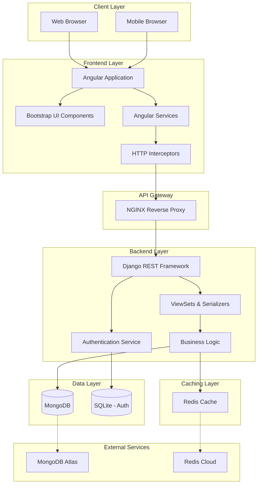
```mermaid
graph TB
    subgraph "Client Layer"
        A[Web Browser]
        B[Mobile Browser]
    end

    subgraph "Frontend Layer"
        C[Angular Application]
        D[Bootstrap UI Components]
        E[Angular Services]
        F[HTTP Interceptors]
    end

    subgraph "API Gateway"
        G[NGINX Reverse Proxy]
    end

    subgraph "Backend Layer"
        H[Django REST Framework]
        I[Authentication Service]
        J[ViewSets & Serializers]
        K[Business Logic]
    end

    subgraph "Caching Layer"
        L[Redis Cache]
    end

    subgraph "Data Layer"
        M[(MongoDB)]
        N[(SQLite - Auth)]
    end

    subgraph "External Services"
        O[MongoDB Atlas]
        P[Redis Cloud]
    end

    A --> C
    B --> C
    C --> D
    C --> E
    E --> F
    F --> G
    G --> H
    H --> I
    H --> J
    J --> K
    K --> L
    K --> M
    I --> N
    M -.-> O
    L -.-> P
```

### Component Interaction Diagram

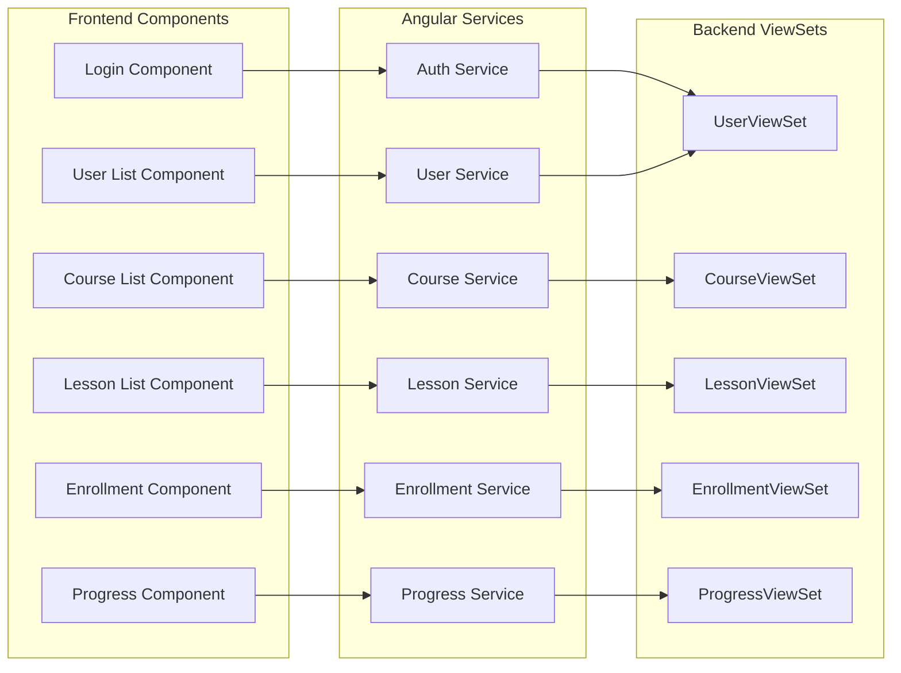
```mermaid
graph LR
    subgraph "Frontend Components"
        A[Login Component]
        B[Course List Component]
        C[Lesson List Component]
        D[User List Component]
        E[Enrollment Component]
        F[Progress Component]
    end

    subgraph "Angular Services"
        G[Auth Service]
        H[Course Service]
        I[Lesson Service]
        J[User Service]
        K[Enrollment Service]
        L[Progress Service]
    end

    subgraph "Backend ViewSets"
        M[UserViewSet]
        N[CourseViewSet]
        O[LessonViewSet]
        P[EnrollmentViewSet]
        Q[ProgressViewSet]
    end

    A --> G
    B --> H
    C --> I
    D --> J
    E --> K
    F --> L

    G --> M
    H --> N
    I --> O
    J --> M
    K --> P
    L --> Q
```

---

## Technology Stack

### MAD Stack Visualization

```mermaid
graph TD
    subgraph "Frontend Stack"
        A[Angular 18+]
        B[TypeScript]
        C[Bootstrap 5]
        D[RxJS]
        E[Chart.js]
        F[Angular Material]
    end

    subgraph "Backend Stack"
        G[Django 4.2+]
        H[Django REST Framework]
        I[Python 3.12]
        J[MongoEngine ODM]
        K[dj-rest-auth]
        L[drf-yasg - Swagger]
    end

    subgraph "Database Stack"
        M[(MongoDB 5.0)]
        N[(SQLite 3)]
        O[(Redis 6)]
    end

    subgraph "DevOps Stack"
        P[Docker]
        Q[Docker Compose]
        R[Kubernetes]
        S[Jenkins]
        T[GitHub Actions]
        U[NGINX]
    end

    subgraph "Testing Stack"
        V[Jest]
        W[Cypress]
        X[Pytest]
    end

    A --> B
    A --> C
    A --> D
    G --> H
    G --> I
    H --> J
    J --> M
    K --> N
    H --> O

    P --> Q
    Q --> R
    S --> T

    style A fill:#dd0031
    style G fill:#092e20
    style M fill:#47a248
    style O fill:#dc382d
    style P fill:#2496ed
```

---

## Architecture Layers

### Layered Architecture

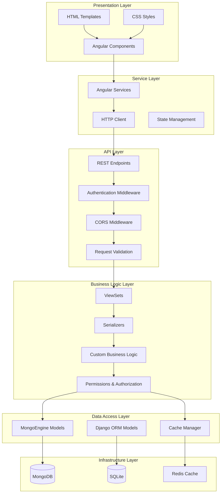
```mermaid
graph TB
    subgraph "Presentation Layer"
        A[Angular Components]
        B[HTML Templates]
        C[CSS Styles]
    end

    subgraph "Service Layer"
        D[Angular Services]
        E[HTTP Client]
        F[State Management]
    end

    subgraph "API Layer"
        G[REST Endpoints]
        H[Authentication Middleware]
        I[CORS Middleware]
        J[Request Validation]
    end

    subgraph "Business Logic Layer"
        K[ViewSets]
        L[Serializers]
        M[Custom Business Logic]
        N[Permissions & Authorization]
    end

    subgraph "Data Access Layer"
        O[MongoEngine Models]
        P[Django ORM Models]
        Q[Cache Manager]
    end

    subgraph "Infrastructure Layer"
        R[(MongoDB)]
        S[(SQLite)]
        T[Redis Cache]
    end

    A --> D
    B --> A
    C --> A
    D --> E
    E --> G
    G --> H
    H --> I
    I --> J
    J --> K
    K --> L
    L --> M
    M --> N
    N --> O
    O --> R
    P --> S
    Q --> T
    N --> Q
```

---

## Database Schema

### MongoDB Collections Schema

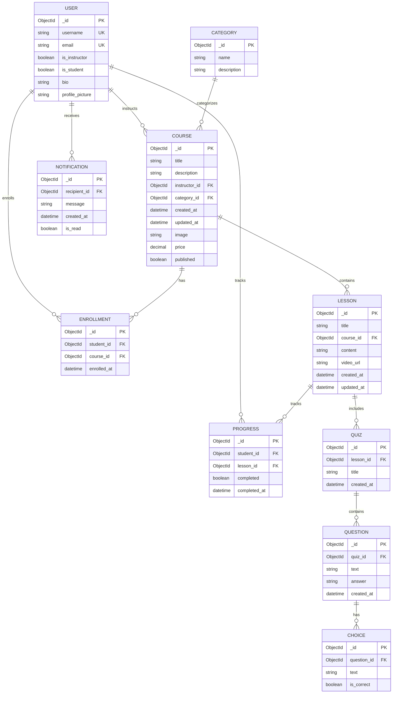
```mermaid
erDiagram
    USER ||--o{ COURSE : instructs
    USER ||--o{ ENROLLMENT : enrolls
    USER ||--o{ PROGRESS : tracks
    USER ||--o{ NOTIFICATION : receives

    CATEGORY ||--o{ COURSE : categorizes

    COURSE ||--o{ LESSON : contains
    COURSE ||--o{ ENROLLMENT : has

    LESSON ||--o{ QUIZ : includes
    LESSON ||--o{ PROGRESS : tracks

    QUIZ ||--o{ QUESTION : contains

    QUESTION ||--o{ CHOICE : has

    USER {
        ObjectId _id PK
        string username UK
        string email UK
        boolean is_instructor
        boolean is_student
        string bio
        string profile_picture
    }

    CATEGORY {
        ObjectId _id PK
        string name
        string description
    }

    COURSE {
        ObjectId _id PK
        string title
        string description
        ObjectId instructor_id FK
        ObjectId category_id FK
        datetime created_at
        datetime updated_at
        string image
        decimal price
        boolean published
    }

    LESSON {
        ObjectId _id PK
        string title
        ObjectId course_id FK
        string content
        string video_url
        datetime created_at
        datetime updated_at
    }

    QUIZ {
        ObjectId _id PK
        ObjectId lesson_id FK
        string title
        datetime created_at
    }

    QUESTION {
        ObjectId _id PK
        ObjectId quiz_id FK
        string text
        string answer
        datetime created_at
    }

    CHOICE {
        ObjectId _id PK
        ObjectId question_id FK
        string text
        boolean is_correct
    }

    ENROLLMENT {
        ObjectId _id PK
        ObjectId student_id FK
        ObjectId course_id FK
        datetime enrolled_at
    }

    PROGRESS {
        ObjectId _id PK
        ObjectId student_id FK
        ObjectId lesson_id FK
        boolean completed
        datetime completed_at
    }

    NOTIFICATION {
        ObjectId _id PK
        ObjectId recipient_id FK
        string message
        datetime created_at
        boolean is_read
    }
```

### Data Relationships

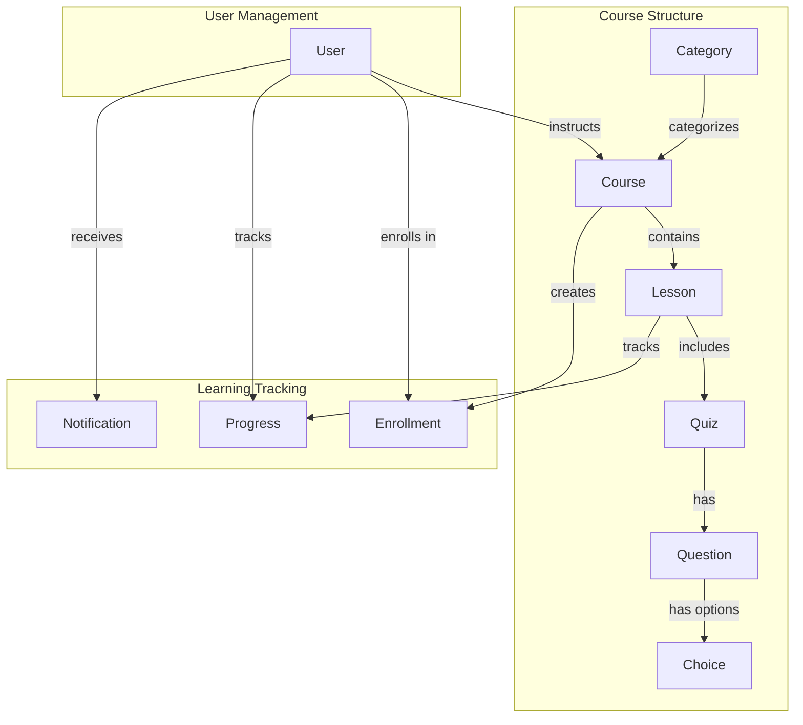
```mermaid
graph TB
    subgraph "User Management"
        A[User]
    end

    subgraph "Course Structure"
        B[Category]
        C[Course]
        D[Lesson]
        E[Quiz]
        F[Question]
        G[Choice]
    end

    subgraph "Learning Tracking"
        H[Enrollment]
        I[Progress]
        J[Notification]
    end

    A -->|instructs| C
    A -->|enrolls in| H
    A -->|tracks| I
    A -->|receives| J

    B -->|categorizes| C
    C -->|contains| D
    D -->|includes| E
    E -->|has| F
    F -->|has options| G

    C -->|creates| H
    D -->|tracks| I
```

---

## API Architecture

### RESTful API Endpoints

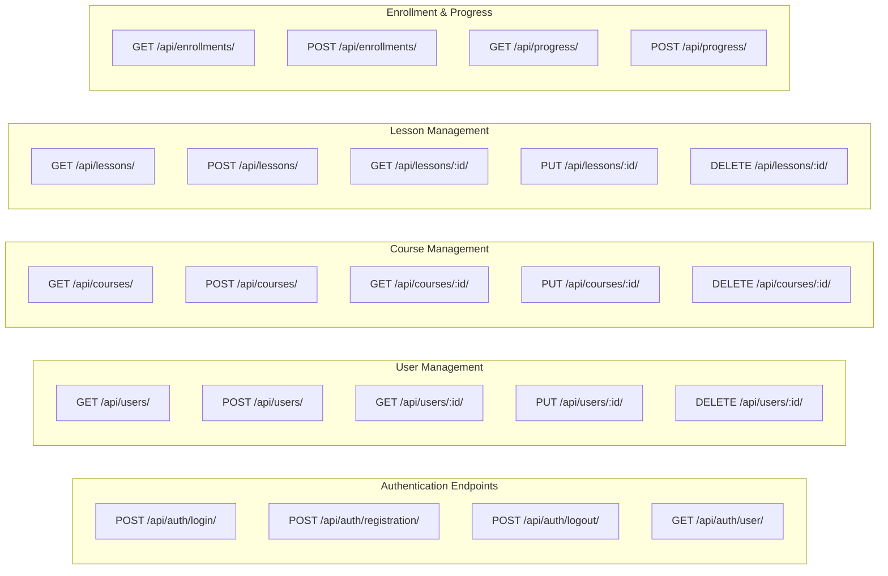
```mermaid
graph LR
    subgraph "Authentication Endpoints"
        A[POST /api/auth/login/]
        B[POST /api/auth/registration/]
        C[POST /api/auth/logout/]
        D[GET /api/auth/user/]
    end

    subgraph "User Management"
        E[GET /api/users/]
        F[POST /api/users/]
        G[GET /api/users/:id/]
        H[PUT /api/users/:id/]
        I[DELETE /api/users/:id/]
    end

    subgraph "Course Management"
        J[GET /api/courses/]
        K[POST /api/courses/]
        L[GET /api/courses/:id/]
        M[PUT /api/courses/:id/]
        N[DELETE /api/courses/:id/]
    end

    subgraph "Lesson Management"
        O[GET /api/lessons/]
        P[POST /api/lessons/]
        Q[GET /api/lessons/:id/]
        R[PUT /api/lessons/:id/]
        S[DELETE /api/lessons/:id/]
    end

    subgraph "Enrollment & Progress"
        T[GET /api/enrollments/]
        U[POST /api/enrollments/]
        V[GET /api/progress/]
        W[POST /api/progress/]
    end
```

### API Request Flow

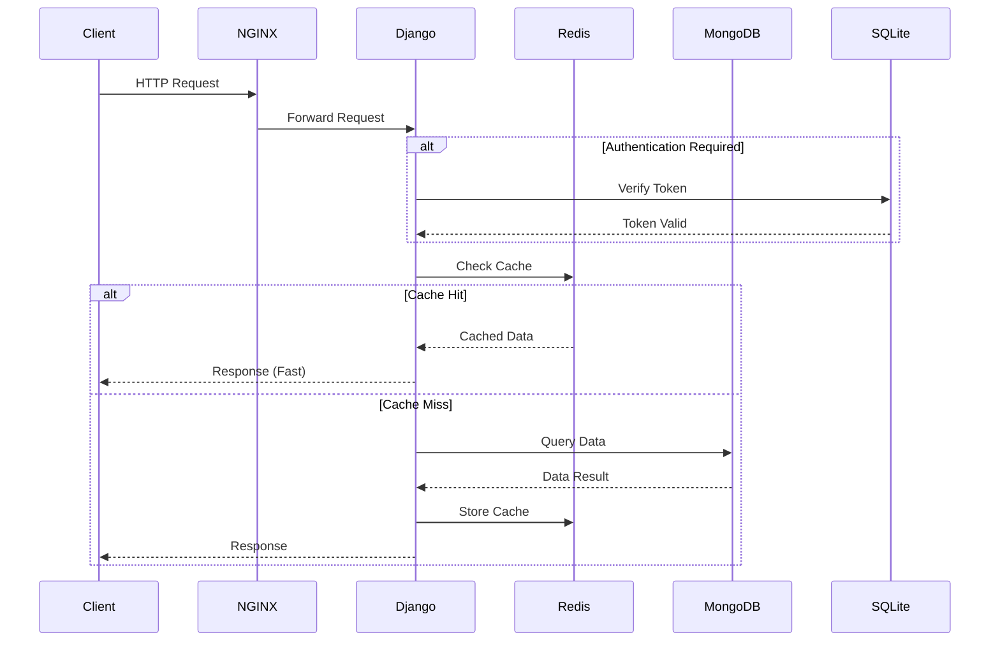
```mermaid
sequenceDiagram
    participant Client
    participant NGINX
    participant Django
    participant Redis
    participant MongoDB
    participant SQLite

    Client->>NGINX: HTTP Request
    NGINX->>Django: Forward Request

    alt Authentication Required
        Django->>SQLite: Verify Token
        SQLite-->>Django: Token Valid
    end

    Django->>Redis: Check Cache

    alt Cache Hit
        Redis-->>Django: Cached Data
        Django-->>Client: Response (Fast)
    else Cache Miss
        Django->>MongoDB: Query Data
        MongoDB-->>Django: Data Result
        Django->>Redis: Store Cache
        Django-->>Client: Response
    end
```

### ViewSet Architecture

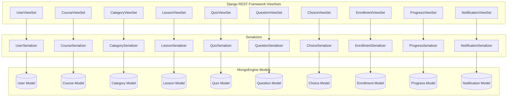
```mermaid
graph TB
    subgraph "Django REST Framework ViewSets"
        A[UserViewSet]
        B[CourseViewSet]
        C[CategoryViewSet]
        D[LessonViewSet]
        E[QuizViewSet]
        F[QuestionViewSet]
        G[ChoiceViewSet]
        H[EnrollmentViewSet]
        I[ProgressViewSet]
        J[NotificationViewSet]
    end

    subgraph "Serializers"
        K[UserSerializer]
        L[CourseSerializer]
        M[CategorySerializer]
        N[LessonSerializer]
        O[QuizSerializer]
        P[QuestionSerializer]
        Q[ChoiceSerializer]
        R[EnrollmentSerializer]
        S[ProgressSerializer]
        T[NotificationSerializer]
    end

    subgraph "MongoEngine Models"
        U[(User Model)]
        V[(Course Model)]
        W[(Category Model)]
        X[(Lesson Model)]
        Y[(Quiz Model)]
        Z[(Question Model)]
        AA[(Choice Model)]
        AB[(Enrollment Model)]
        AC[(Progress Model)]
        AD[(Notification Model)]
    end

    A --> K --> U
    B --> L --> V
    C --> M --> W
    D --> N --> X
    E --> O --> Y
    F --> P --> Z
    G --> Q --> AA
    H --> R --> AB
    I --> S --> AC
    J --> T --> AD
```

---

## Frontend Architecture

### Angular Application Structure

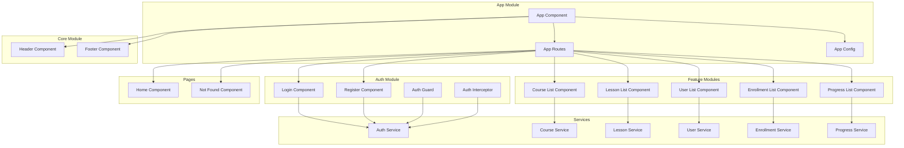
```mermaid
graph TB
    subgraph "App Module"
        A[App Component]
        B[App Routes]
        C[App Config]
    end

    subgraph "Core Module"
        D[Header Component]
        E[Footer Component]
    end

    subgraph "Auth Module"
        F[Login Component]
        G[Register Component]
        H[Auth Guard]
        I[Auth Interceptor]
    end

    subgraph "Feature Modules"
        J[Course List Component]
        K[Lesson List Component]
        L[User List Component]
        M[Enrollment List Component]
        N[Progress List Component]
    end

    subgraph "Services"
        O[Auth Service]
        P[Course Service]
        Q[Lesson Service]
        R[User Service]
        S[Enrollment Service]
        T[Progress Service]
    end

    subgraph "Pages"
        U[Home Component]
        V[Not Found Component]
    end

    A --> B
    A --> C
    A --> D
    A --> E

    B --> F
    B --> G
    B --> J
    B --> K
    B --> L
    B --> M
    B --> N
    B --> U
    B --> V

    F --> O
    G --> O
    J --> P
    K --> Q
    L --> R
    M --> S
    N --> T

    H --> O
    I --> O
```

### Component Communication

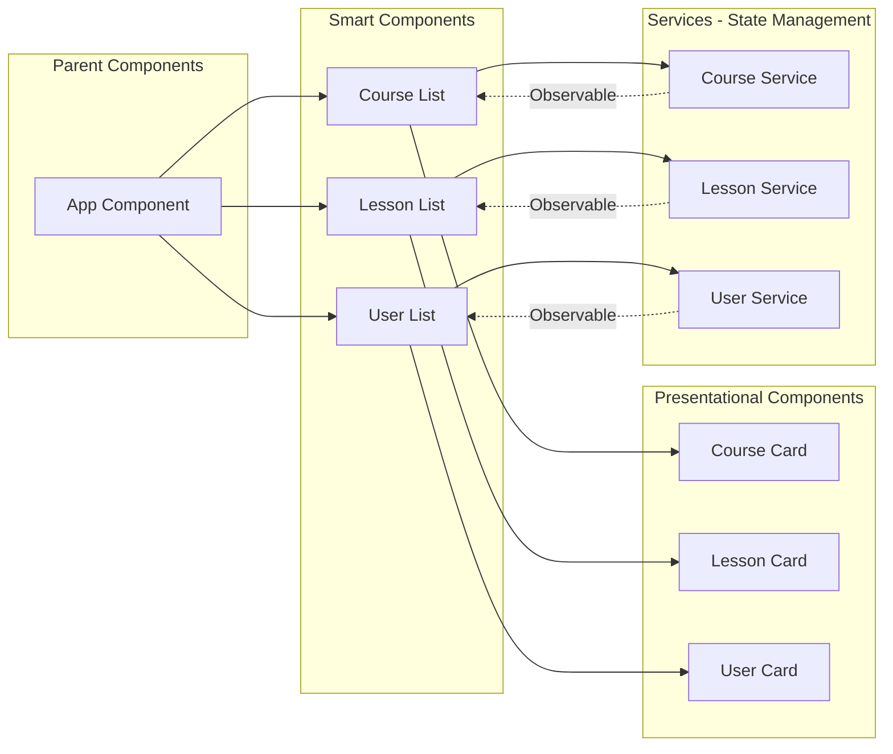
```mermaid
graph LR
    subgraph "Parent Components"
        A[App Component]
    end

    subgraph "Smart Components"
        B[Course List]
        C[Lesson List]
        D[User List]
    end

    subgraph "Presentational Components"
        E[Course Card]
        F[Lesson Card]
        G[User Card]
    end

    subgraph "Services - State Management"
        H[Course Service]
        I[Lesson Service]
        J[User Service]
    end

    A --> B
    A --> C
    A --> D

    B --> E
    C --> F
    D --> G

    B --> H
    C --> I
    D --> J

    H -.->|Observable| B
    I -.->|Observable| C
    J -.->|Observable| D
```

### Service Layer Architecture

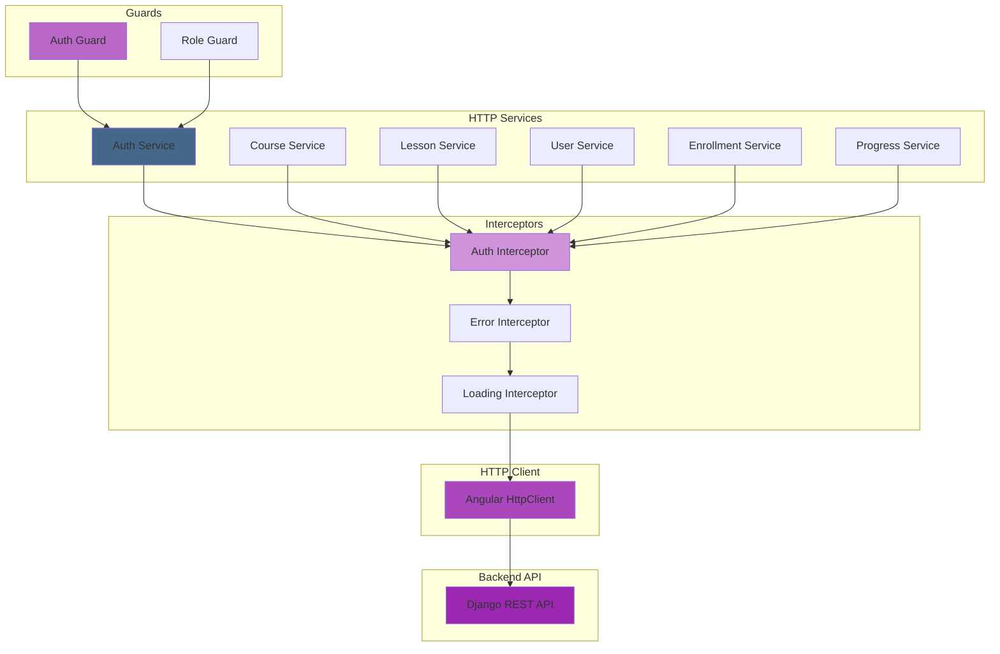
```mermaid
graph TB
    subgraph "HTTP Services"
        A[Auth Service]
        B[Course Service]
        C[Lesson Service]
        D[User Service]
        E[Enrollment Service]
        F[Progress Service]
    end

    subgraph "Interceptors"
        G[Auth Interceptor]
        H[Error Interceptor]
        I[Loading Interceptor]
    end

    subgraph "Guards"
        J[Auth Guard]
        K[Role Guard]
    end

    subgraph "HTTP Client"
        L[Angular HttpClient]
    end

    subgraph "Backend API"
        M[Django REST API]
    end

    A --> G
    B --> G
    C --> G
    D --> G
    E --> G
    F --> G

    G --> H
    H --> I
    I --> L

    J --> A
    K --> A

    L --> M

    style A fill:#456789
    style G fill:#ce93d8
    style J fill:#ba68c8
    style L fill:#ab47bc
    style M fill:#9c27b0
```

---

## Authentication Flow

### User Authentication Sequence

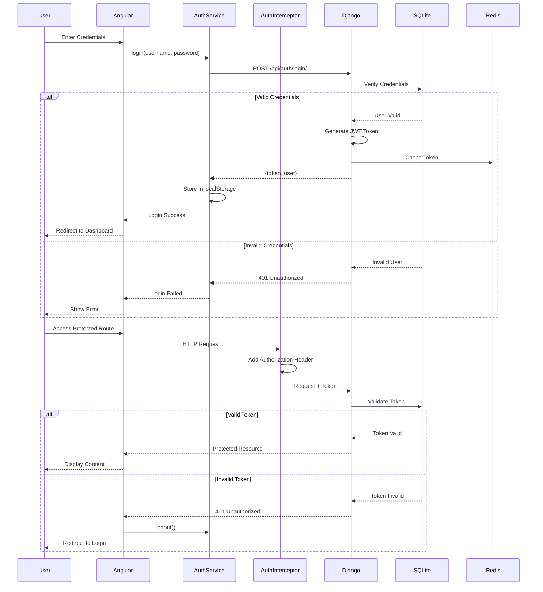
```mermaid
sequenceDiagram
    participant User
    participant Angular
    participant AuthService
    participant AuthInterceptor
    participant Django
    participant SQLite
    participant Redis

    User->>Angular: Enter Credentials
    Angular->>AuthService: login(username, password)
    AuthService->>Django: POST /api/auth/login/
    Django->>SQLite: Verify Credentials

    alt Valid Credentials
        SQLite-->>Django: User Valid
        Django->>Django: Generate JWT Token
        Django->>Redis: Cache Token
        Django-->>AuthService: {token, user}
        AuthService->>AuthService: Store in localStorage
        AuthService-->>Angular: Login Success
        Angular-->>User: Redirect to Dashboard
    else Invalid Credentials
        SQLite-->>Django: Invalid User
        Django-->>AuthService: 401 Unauthorized
        AuthService-->>Angular: Login Failed
        Angular-->>User: Show Error
    end

    User->>Angular: Access Protected Route
    Angular->>AuthInterceptor: HTTP Request
    AuthInterceptor->>AuthInterceptor: Add Authorization Header
    AuthInterceptor->>Django: Request + Token
    Django->>SQLite: Validate Token

    alt Valid Token
        SQLite-->>Django: Token Valid
        Django-->>Angular: Protected Resource
        Angular-->>User: Display Content
    else Invalid Token
        SQLite-->>Django: Token Invalid
        Django-->>Angular: 401 Unauthorized
        Angular->>AuthService: logout()
        Angular-->>User: Redirect to Login
    end
```

### Registration Flow

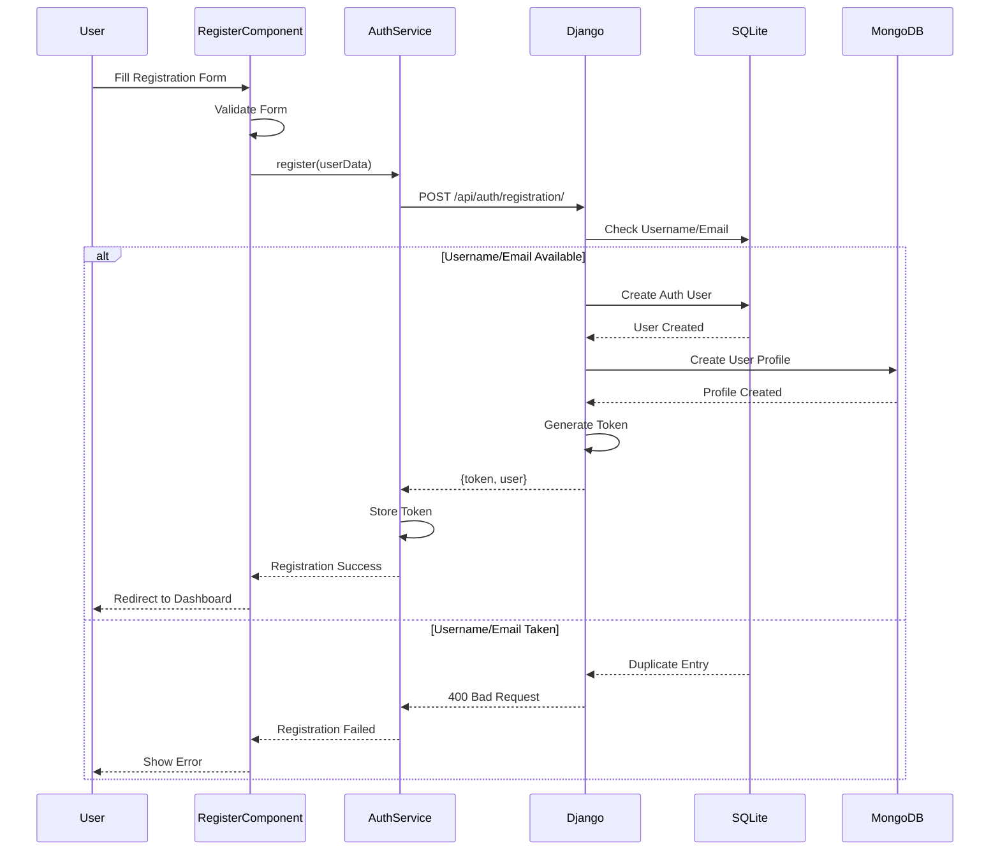
```mermaid
sequenceDiagram
    participant User
    participant RegisterComponent
    participant AuthService
    participant Django
    participant SQLite
    participant MongoDB

    User->>RegisterComponent: Fill Registration Form
    RegisterComponent->>RegisterComponent: Validate Form
    RegisterComponent->>AuthService: register(userData)
    AuthService->>Django: POST /api/auth/registration/

    Django->>SQLite: Check Username/Email

    alt Username/Email Available
        Django->>SQLite: Create Auth User
        SQLite-->>Django: User Created
        Django->>MongoDB: Create User Profile
        MongoDB-->>Django: Profile Created
        Django->>Django: Generate Token
        Django-->>AuthService: {token, user}
        AuthService->>AuthService: Store Token
        AuthService-->>RegisterComponent: Registration Success
        RegisterComponent-->>User: Redirect to Dashboard
    else Username/Email Taken
        SQLite-->>Django: Duplicate Entry
        Django-->>AuthService: 400 Bad Request
        AuthService-->>RegisterComponent: Registration Failed
        RegisterComponent-->>User: Show Error
    end
```

### JWT Token Flow

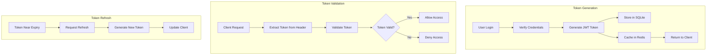
```mermaid
graph TB
    subgraph "Token Generation"
        A[User Login]
        B[Verify Credentials]
        C[Generate JWT Token]
        D[Store in SQLite]
        E[Cache in Redis]
        F[Return to Client]
    end

    subgraph "Token Validation"
        G[Client Request]
        H[Extract Token from Header]
        I[Validate Token]
        J{Token Valid?}
        K[Allow Access]
        L[Deny Access]
    end

    subgraph "Token Refresh"
        M[Token Near Expiry]
        N[Request Refresh]
        O[Generate New Token]
        P[Update Client]
    end

    A --> B
    B --> C
    C --> D
    C --> E
    E --> F

    G --> H
    H --> I
    I --> J
    J -->|Yes| K
    J -->|No| L

    M --> N
    N --> O
    O --> P
```

---

## Data Flow

### Course Enrollment Flow

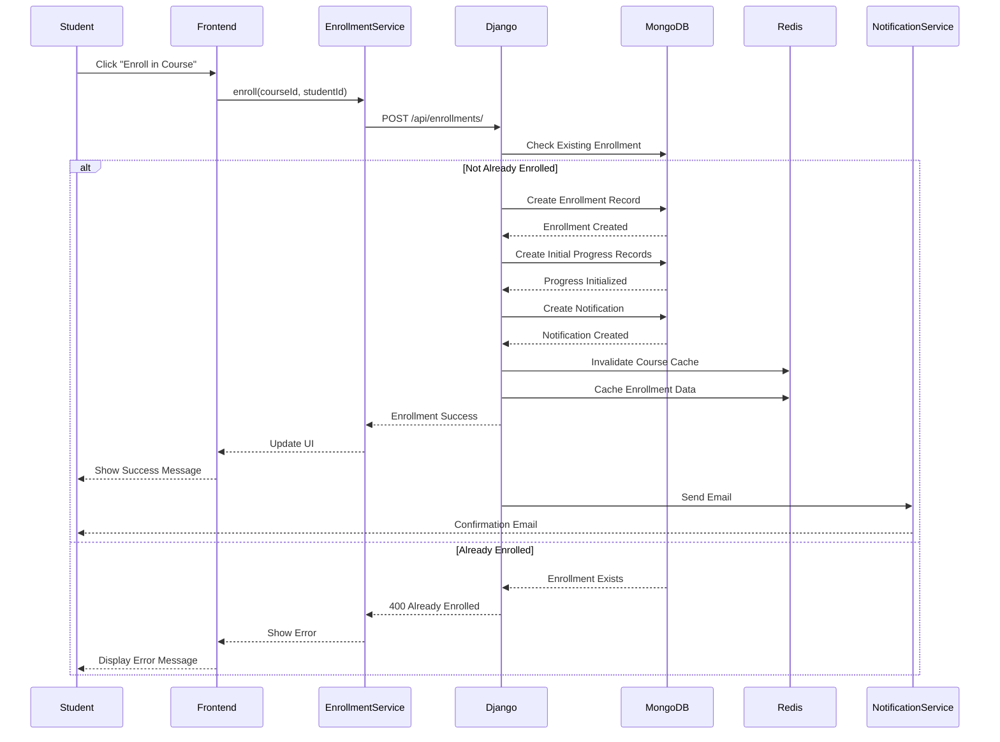
```mermaid
sequenceDiagram
    participant Student
    participant Frontend
    participant EnrollmentService
    participant Django
    participant MongoDB
    participant Redis
    participant NotificationService

    Student->>Frontend: Click "Enroll in Course"
    Frontend->>EnrollmentService: enroll(courseId, studentId)
    EnrollmentService->>Django: POST /api/enrollments/

    Django->>MongoDB: Check Existing Enrollment

    alt Not Already Enrolled
        Django->>MongoDB: Create Enrollment Record
        MongoDB-->>Django: Enrollment Created

        Django->>MongoDB: Create Initial Progress Records
        MongoDB-->>Django: Progress Initialized

        Django->>MongoDB: Create Notification
        MongoDB-->>Django: Notification Created

        Django->>Redis: Invalidate Course Cache
        Django->>Redis: Cache Enrollment Data

        Django-->>EnrollmentService: Enrollment Success
        EnrollmentService-->>Frontend: Update UI
        Frontend-->>Student: Show Success Message

        Django->>NotificationService: Send Email
        NotificationService-->>Student: Confirmation Email
    else Already Enrolled
        MongoDB-->>Django: Enrollment Exists
        Django-->>EnrollmentService: 400 Already Enrolled
        EnrollmentService-->>Frontend: Show Error
        Frontend-->>Student: Display Error Message
    end
```

### Progress Tracking Flow

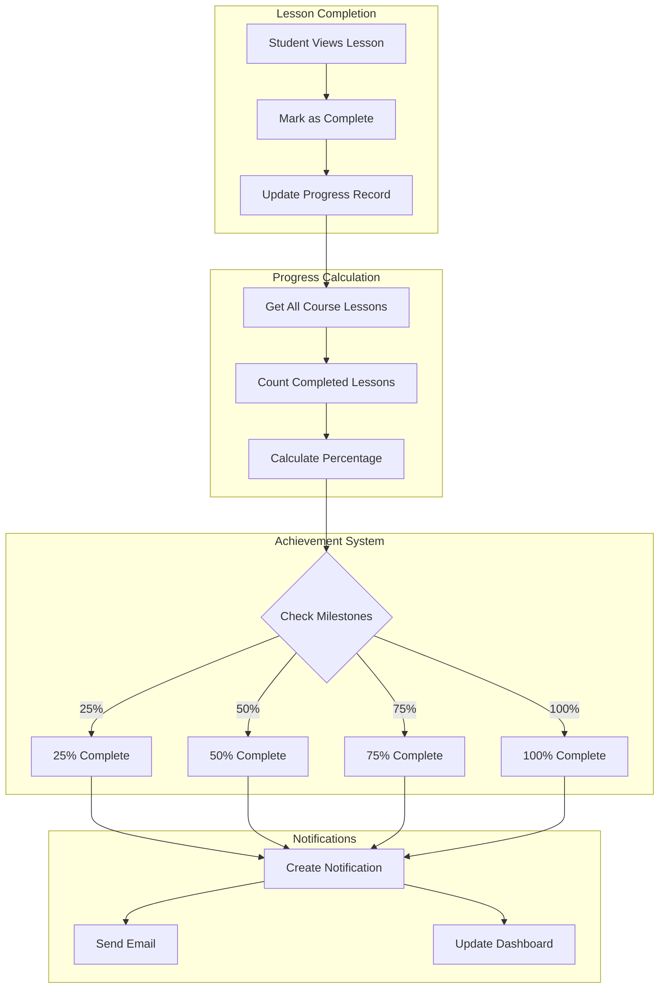
```mermaid
graph TB
    subgraph "Lesson Completion"
        A[Student Views Lesson]
        B[Mark as Complete]
        C[Update Progress Record]
    end

    subgraph "Progress Calculation"
        D[Get All Course Lessons]
        E[Count Completed Lessons]
        F[Calculate Percentage]
    end

    subgraph "Achievement System"
        G{Check Milestones}
        H[25% Complete]
        I[50% Complete]
        J[75% Complete]
        K[100% Complete]
    end

    subgraph "Notifications"
        L[Create Notification]
        M[Send Email]
        N[Update Dashboard]
    end

    A --> B
    B --> C
    C --> D
    D --> E
    E --> F
    F --> G

    G -->|25%| H
    G -->|50%| I
    G -->|75%| J
    G -->|100%| K

    H --> L
    I --> L
    J --> L
    K --> L

    L --> M
    L --> N
```

### Quiz Submission Flow

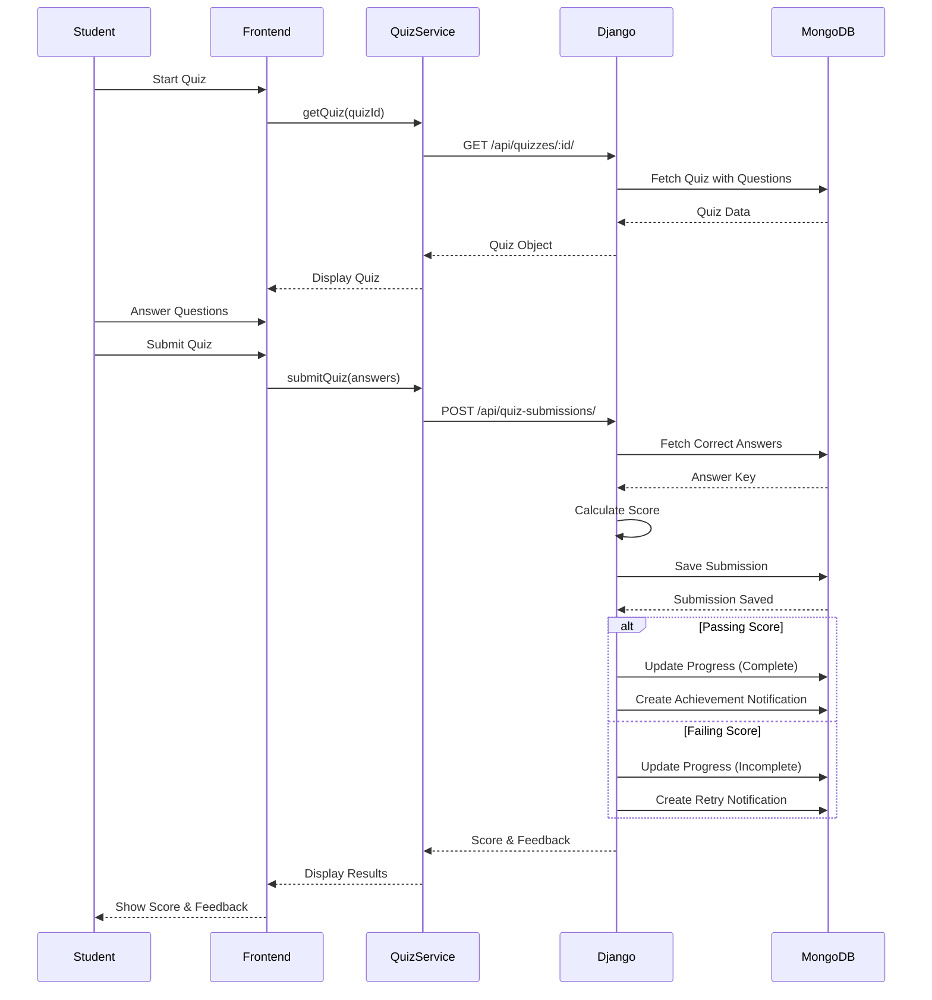
```mermaid
sequenceDiagram
    participant Student
    participant Frontend
    participant QuizService
    participant Django
    participant MongoDB

    Student->>Frontend: Start Quiz
    Frontend->>QuizService: getQuiz(quizId)
    QuizService->>Django: GET /api/quizzes/:id/
    Django->>MongoDB: Fetch Quiz with Questions
    MongoDB-->>Django: Quiz Data
    Django-->>QuizService: Quiz Object
    QuizService-->>Frontend: Display Quiz

    Student->>Frontend: Answer Questions
    Student->>Frontend: Submit Quiz

    Frontend->>QuizService: submitQuiz(answers)
    QuizService->>Django: POST /api/quiz-submissions/

    Django->>MongoDB: Fetch Correct Answers
    MongoDB-->>Django: Answer Key

    Django->>Django: Calculate Score
    Django->>MongoDB: Save Submission
    MongoDB-->>Django: Submission Saved

    alt Passing Score
        Django->>MongoDB: Update Progress (Complete)
        Django->>MongoDB: Create Achievement Notification
    else Failing Score
        Django->>MongoDB: Update Progress (Incomplete)
        Django->>MongoDB: Create Retry Notification
    end

    Django-->>QuizService: Score & Feedback
    QuizService-->>Frontend: Display Results
    Frontend-->>Student: Show Score & Feedback
```

---

## Deployment Architecture

### Docker Container Architecture

```mermaid
graph TB
    subgraph "Docker Compose Stack"
        A[NGINX Container]
        B[Frontend Container]
        C[Backend Container]
        D[MongoDB Container]
        E[Redis Container]
    end

    subgraph "Volumes"
        F[mongodb_data]
        G[backend_static]
        H[frontend_dist]
    end

    subgraph "Networks"
        I[lms_network]
    end

    subgraph "External Services"
        J[MongoDB Atlas]
        K[Redis Cloud]
    end

    A --> B
    A --> C
    C --> D
    C --> E

    D --> F
    C --> G
    B --> H

    A -.-> I
    B -.-> I
    C -.-> I
    D -.-> I
    E -.-> I

    C -.->|Backup| J
    C -.->|Backup| K

    style A fill:#009639
    style B fill:#dd0031
    style C fill:#092e20
    style D fill:#47a248
    style E fill:#dc382d
```

### Kubernetes Deployment

```mermaid
graph TB
    subgraph "Kubernetes Cluster"
        subgraph "Frontend Namespace"
            A[Frontend Deployment]
            B[Frontend Service]
            C[Frontend Pods x3]
        end

        subgraph "Backend Namespace"
            D[Backend Deployment]
            E[Backend Service]
            F[Backend Pods x3]
        end

        subgraph "Database Namespace"
            G[MongoDB StatefulSet]
            H[MongoDB Service]
            I[Persistent Volumes]
        end

        subgraph "Cache Namespace"
            J[Redis Deployment]
            K[Redis Service]
        end

        subgraph "Ingress"
            L[Ingress Controller]
            M[SSL/TLS Termination]
        end

        subgraph "Config & Secrets"
            N[ConfigMap]
            O[Secrets]
        end
    end

    L --> M
    M --> B
    M --> E

    A --> C
    D --> F
    G --> I

    B --> C
    E --> F
    H --> G
    K --> J

    F --> H
    F --> K

    N --> F
    O --> F

    style L fill:#326ce5
    style A fill:#dd0031
    style D fill:#092e20
    style G fill:#47a248
    style J fill:#dc382d
```

### AWS Production Infrastructure

```mermaid
graph TB
    subgraph "AWS Cloud - Production Architecture"
        subgraph "Route 53"
            R53[DNS Management]
        end

        subgraph "CloudFront CDN"
            CF[Global Edge Locations]
            WAF[Web Application Firewall]
        end

        subgraph "VPC - Multi-AZ"
            subgraph "Public Subnets"
                ALB[Application Load Balancer]
                NAT1[NAT Gateway AZ1]
                NAT2[NAT Gateway AZ2]
            end

            subgraph "Private Subnets - AZ1"
                ECS1A[ECS Backend Tasks]
                ECS1B[ECS Frontend Tasks]
            end

            subgraph "Private Subnets - AZ2"
                ECS2A[ECS Backend Tasks]
                ECS2B[ECS Frontend Tasks]
            end

            subgraph "Database Subnets"
                RDS1[RDS Primary<br/>PostgreSQL]
                RDS2[RDS Standby<br/>PostgreSQL]
                DOCDB[DocumentDB Cluster<br/>MongoDB-compatible]
                REDIS[ElastiCache Redis<br/>Multi-AZ]
            end
        end

        subgraph "Container Registry"
            ECR[Amazon ECR<br/>Backend & Frontend Images]
        end

        subgraph "Storage"
            S3A[S3 Static Assets]
            S3B[S3 Backups]
        end

        subgraph "Security & Secrets"
            SM[Secrets Manager]
            KMS[AWS KMS]
            SG[Security Groups]
        end

        subgraph "Monitoring & Logging"
            CW[CloudWatch]
            XRAY[X-Ray Tracing]
            SNS[SNS Alerts]
        end
    end

    R53 --> CF
    CF --> WAF
    WAF --> ALB

    ALB --> ECS1A
    ALB --> ECS1B
    ALB --> ECS2A
    ALB --> ECS2B

    ECS1A --> NAT1
    ECS1B --> NAT1
    ECS2A --> NAT2
    ECS2B --> NAT2

    ECS1A --> RDS1
    ECS2A --> RDS1
    RDS1 -.->|Replication| RDS2

    ECS1A --> DOCDB
    ECS2A --> DOCDB

    ECS1A --> REDIS
    ECS2A --> REDIS

    ECR -.->|Pull Images| ECS1A
    ECR -.->|Pull Images| ECS2A

    CF --> S3A

    SM --> ECS1A
    SM --> ECS2A
    KMS --> SM

    CW --> SNS
    XRAY --> CW

    ECS1A --> CW
    ECS2A --> CW
```

### Terraform Infrastructure as Code

```mermaid
graph LR
    subgraph "Terraform Modules"
        VPC[VPC Module<br/>- 3 AZs<br/>- Public/Private/DB Subnets<br/>- NAT Gateways<br/>- Route Tables]

        SEC[Security Module<br/>- Security Groups<br/>- NACLs<br/>- WAF Rules<br/>- IAM Roles/Policies]

        ECR_MOD[ECR Module<br/>- Backend Repository<br/>- Frontend Repository<br/>- Lifecycle Policies]

        RDS[RDS Module<br/>- PostgreSQL 15<br/>- Multi-AZ<br/>- Auto Backups<br/>- Encryption]

        CACHE[ElastiCache Module<br/>- Redis 7<br/>- Cluster Mode<br/>- Multi-AZ<br/>- Snapshots]

        ECS[ECS Module<br/>- Fargate Cluster<br/>- Task Definitions<br/>- Services<br/>- Auto-scaling]

        ALB_MOD[ALB Module<br/>- Target Groups<br/>- Listeners<br/>- SSL/TLS<br/>- Health Checks]

        S3_MOD[S3 Module<br/>- Static Assets<br/>- Backups<br/>- Versioning<br/>- Lifecycle Rules]

        CF_MOD[CloudFront Module<br/>- Distribution<br/>- Origin Config<br/>- Cache Behaviors]

        R53[Route53 Module<br/>- Hosted Zone<br/>- DNS Records<br/>- Health Checks]
    end

    VPC --> SEC
    VPC --> RDS
    VPC --> CACHE
    VPC --> ECS
    VPC --> ALB_MOD

    SEC --> ECS
    SEC --> RDS
    SEC --> CACHE
    SEC --> ALB_MOD

    ECR_MOD --> ECS
    RDS --> ECS
    CACHE --> ECS
    ALB_MOD --> ECS

    S3_MOD --> CF_MOD
    CF_MOD --> R53
    ALB_MOD --> R53
```

### Cloud Infrastructure Options

```mermaid
graph TB
    subgraph "Option 1: Vercel + Render (Current)"
        A[Vercel CDN]
        B[Edge Network]
        C[Static Assets]
        D[Render Service]
        E[Auto-scaling]
        F[Health Checks]
    end

    subgraph "Option 2: AWS Full Stack (Production)"
        G[CloudFront]
        H[ALB + ECS Fargate]
        I[RDS + DocumentDB]
        J[ElastiCache Redis]
        K[S3 + CloudWatch]
    end

    subgraph "Option 3: Kubernetes (Self-Hosted)"
        L[K8s Ingress]
        M[K8s Services]
        N[StatefulSets]
        O[ConfigMaps]
    end

    subgraph "Shared Services"
        P[MongoDB Atlas]
        Q[Redis Cloud]
        R[GitHub Actions]
        S[Jenkins CI/CD]
    end

    A --> B
    B --> C
    D --> E
    E --> F

    G --> H
    H --> I
    H --> J
    K --> H

    L --> M
    M --> N
    O --> M

    C -.->|Alternative| P
    F -.->|Alternative| P
    I -.->|Alternative| P
    N -.->|Alternative| P

    R --> S
    S --> A
    S --> D
    S --> G
    S --> L
```

---

## AWS & Terraform Infrastructure

### Infrastructure Overview

The Learning Management System provides production-ready infrastructure using AWS services and Terraform for Infrastructure as Code (IaC). This enables scalable, secure, and highly available deployments.

#### Key Features

- **Multi-AZ Deployment**: High availability across multiple availability zones
- **Auto-Scaling**: Automatic scaling based on demand
- **Security**: Multiple layers of security controls
- **Monitoring**: Comprehensive monitoring and alerting
- **Disaster Recovery**: Automated backups and recovery procedures
- **Cost Optimization**: Right-sized resources with optimization strategies

### AWS Service Architecture

```mermaid
graph TB
    subgraph "Compute Layer"
        ECS[Amazon ECS Fargate<br/>Serverless Containers]
        LAMBDA[AWS Lambda<br/>Serverless Functions]
    end

    subgraph "Data Layer"
        RDS[Amazon RDS<br/>PostgreSQL]
        DOCDB[Amazon DocumentDB<br/>MongoDB Compatible]
        REDIS[Amazon ElastiCache<br/>Redis]
        S3[Amazon S3<br/>Object Storage]
    end

    subgraph "Network Layer"
        VPC[Amazon VPC<br/>Isolated Network]
        ALB[Application Load Balancer<br/>Traffic Distribution]
        R53[Route 53<br/>DNS]
        CF[CloudFront<br/>CDN]
    end

    subgraph "Security Layer"
        IAM[IAM Roles/Policies]
        SM[Secrets Manager]
        KMS[KMS Encryption]
        WAF[AWS WAF]
        SG[Security Groups]
    end

    subgraph "Operations Layer"
        CW[CloudWatch<br/>Monitoring]
        XRAY[X-Ray<br/>Tracing]
        BACKUP[AWS Backup]
        CT[CloudTrail<br/>Audit]
    end

    R53 --> CF
    CF --> ALB
    ALB --> ECS
    ECS --> VPC

    ECS --> RDS
    ECS --> DOCDB
    ECS --> REDIS
    ECS --> S3

    IAM --> ECS
    SM --> ECS
    KMS --> RDS
    KMS --> DOCDB
    WAF --> CF
    SG --> ECS

    CW --> ECS
    XRAY --> ECS
    BACKUP --> RDS
    BACKUP --> DOCDB
    CT --> IAM
```

### Terraform Module Structure

```mermaid
graph TD
    ROOT[Root Configuration<br/>main.tf, variables.tf, outputs.tf]

    ROOT --> VPC_MOD[VPC Module]
    ROOT --> SEC_MOD[Security Module]
    ROOT --> ECR_MOD[ECR Module]
    ROOT --> RDS_MOD[RDS Module]
    ROOT --> CACHE_MOD[ElastiCache Module]
    ROOT --> ECS_MOD[ECS Module]
    ROOT --> ALB_MOD[ALB Module]
    ROOT --> S3_MOD[S3 Module]
    ROOT --> CF_MOD[CloudFront Module]
    ROOT --> R53_MOD[Route53 Module]

    VPC_MOD --> VPC_RES[VPC Resources<br/>- VPC<br/>- Subnets<br/>- Route Tables<br/>- NAT Gateways<br/>- Internet Gateway]

    SEC_MOD --> SEC_RES[Security Resources<br/>- Security Groups<br/>- NACLs<br/>- WAF Rules<br/>- IAM Roles]

    ECR_MOD --> ECR_RES[ECR Repositories<br/>- Backend Image<br/>- Frontend Image<br/>- Lifecycle Policies]

    RDS_MOD --> RDS_RES[RDS Instance<br/>- PostgreSQL<br/>- Multi-AZ<br/>- Automated Backups]

    CACHE_MOD --> CACHE_RES[ElastiCache Cluster<br/>- Redis<br/>- Replication Group<br/>- Snapshots]

    ECS_MOD --> ECS_RES[ECS Resources<br/>- Cluster<br/>- Task Definitions<br/>- Services<br/>- Auto-scaling]

    ALB_MOD --> ALB_RES[ALB Resources<br/>- Load Balancer<br/>- Target Groups<br/>- Listeners]

    S3_MOD --> S3_RES[S3 Buckets<br/>- Static Assets<br/>- Backups<br/>- Lifecycle Rules]

    CF_MOD --> CF_RES[CloudFront<br/>- Distribution<br/>- Origins<br/>- Cache Behaviors]

    R53_MOD --> R53_RES[Route53 Resources<br/>- Hosted Zone<br/>- DNS Records]

    style ROOT fill:#764ABC
    style VPC_MOD fill:#326CE5
    style RDS_MOD fill:#527FFF
    style CACHE_MOD fill:#DC382D
```

### Deployment Environments

```mermaid
graph LR
    subgraph "Development"
        DEV_TF[Terraform Dev<br/>environments/dev/]
        DEV_AWS[AWS Dev Account<br/>- Single AZ<br/>- t3.micro instances<br/>- Minimal resources]
    end

    subgraph "Staging"
        STG_TF[Terraform Staging<br/>environments/staging/]
        STG_AWS[AWS Staging Account<br/>- Multi-AZ<br/>- t3.small instances<br/>- Production-like]
    end

    subgraph "Production"
        PROD_TF[Terraform Production<br/>environments/production/]
        PROD_AWS[AWS Production Account<br/>- Multi-AZ<br/>- Production instances<br/>- Full redundancy]
    end

    subgraph "Shared State"
        S3_STATE[S3 Backend<br/>Terraform State]
        DYNAMO[DynamoDB<br/>State Locking]
    end

    DEV_TF --> DEV_AWS
    STG_TF --> STG_AWS
    PROD_TF --> PROD_AWS

    DEV_TF --> S3_STATE
    STG_TF --> S3_STATE
    PROD_TF --> S3_STATE

    S3_STATE --> DYNAMO
```

### Resource Tagging Strategy

```mermaid
graph TB
    subgraph "Mandatory Tags"
        ENV[Environment<br/>dev/staging/production]
        PROJ[Project<br/>lms]
        MANAGED[ManagedBy<br/>Terraform]
        OWNER[Owner<br/>Team Name]
    end

    subgraph "Optional Tags"
        COST[CostCenter]
        APP[Application]
        VERSION[Version]
        BACKUP[BackupPolicy]
    end

    subgraph "Applied To"
        VPC_TAG[VPC Resources]
        ECS_TAG[ECS Resources]
        RDS_TAG[Database Resources]
        S3_TAG[Storage Resources]
    end

    ENV --> VPC_TAG
    PROJ --> VPC_TAG
    MANAGED --> VPC_TAG
    OWNER --> VPC_TAG

    ENV --> ECS_TAG
    PROJ --> ECS_TAG
    MANAGED --> ECS_TAG
    OWNER --> ECS_TAG

    ENV --> RDS_TAG
    PROJ --> RDS_TAG
    MANAGED --> RDS_TAG
    OWNER --> RDS_TAG

    ENV --> S3_TAG
    PROJ --> S3_TAG
    MANAGED --> S3_TAG
    OWNER --> S3_TAG

    COST -.-> VPC_TAG
    COST -.-> ECS_TAG
    COST -.-> RDS_TAG
    COST -.-> S3_TAG

    style ENV fill:#4CAF50
    style PROJ fill:#2196F3
    style MANAGED fill:#FF9800
    style OWNER fill:#9C27B0
```

### Network Architecture Details

```mermaid
graph TB
    subgraph "VPC 10.0.0.0/16"
        subgraph "Availability Zone A"
            PUB_A[Public Subnet<br/>10.0.1.0/24]
            PRIV_A[Private Subnet<br/>10.0.11.0/24]
            DB_A[Database Subnet<br/>10.0.21.0/24]
        end

        subgraph "Availability Zone B"
            PUB_B[Public Subnet<br/>10.0.2.0/24]
            PRIV_B[Private Subnet<br/>10.0.12.0/24]
            DB_B[Database Subnet<br/>10.0.22.0/24]
        end

        subgraph "Availability Zone C"
            PUB_C[Public Subnet<br/>10.0.3.0/24]
            PRIV_C[Private Subnet<br/>10.0.13.0/24]
            DB_C[Database Subnet<br/>10.0.23.0/24]
        end

        IGW[Internet Gateway]
        NAT_A[NAT Gateway A]
        NAT_B[NAT Gateway B]
        NAT_C[NAT Gateway C]
    end

    INTERNET[Internet]

    INTERNET --> IGW
    IGW --> PUB_A
    IGW --> PUB_B
    IGW --> PUB_C

    PUB_A --> NAT_A
    PUB_B --> NAT_B
    PUB_C --> NAT_C

    NAT_A --> PRIV_A
    NAT_B --> PRIV_B
    NAT_C --> PRIV_C

    PRIV_A --> DB_A
    PRIV_B --> DB_B
    PRIV_C --> DB_C
```

### Infrastructure Provisioning Workflow

```mermaid
sequenceDiagram
    participant DEV as Developer
    participant GIT as Git Repository
    participant TF as Terraform
    participant AWS as AWS Cloud

    DEV->>GIT: 1. Commit Infrastructure Code
    GIT->>TF: 2. Trigger Terraform Plan
    TF->>TF: 3. Initialize Backend
    TF->>TF: 4. Validate Configuration
    TF->>AWS: 5. Read Current State
    AWS-->>TF: 6. Return State
    TF->>TF: 7. Generate Execution Plan
    TF-->>DEV: 8. Show Plan Output

    alt Plan Approved
        DEV->>TF: 9. Approve & Apply
        TF->>AWS: 10. Create VPC Resources
        AWS-->>TF: 11. VPC Created
        TF->>AWS: 12. Create Security Groups
        AWS-->>TF: 13. SGs Created
        TF->>AWS: 14. Create RDS/Redis
        AWS-->>TF: 15. DBs Created
        TF->>AWS: 16. Create ECS Cluster
        AWS-->>TF: 17. ECS Created
        TF->>AWS: 18. Create ALB
        AWS-->>TF: 19. ALB Created
        TF->>TF: 20. Update State
        TF-->>DEV: 21. Deployment Complete
    else Plan Rejected
        DEV->>GIT: 22. Update Code
    end
```

### Cost Optimization Strategies

```mermaid
graph TD
    OPTIMIZE[Cost Optimization]

    OPTIMIZE --> COMPUTE[Compute Optimization]
    OPTIMIZE --> STORAGE[Storage Optimization]
    OPTIMIZE --> NETWORK[Network Optimization]
    OPTIMIZE --> DATABASE[Database Optimization]

    COMPUTE --> RIGHTSIZE[Right-sizing<br/>EC2/ECS]
    COMPUTE --> SPOT[Spot Instances<br/>Non-prod]
    COMPUTE --> RESERVED[Reserved Instances<br/>Predictable workloads]
    COMPUTE --> AUTOSCALE[Auto-scaling<br/>Match demand]

    STORAGE --> LIFECYCLE[S3 Lifecycle<br/>Policies]
    STORAGE --> IA[Infrequent Access<br/>Storage class]
    STORAGE --> GLACIER[Glacier<br/>Long-term backups]

    NETWORK --> NAT_OPT[NAT Gateway<br/>Optimization]
    NETWORK --> ENDPOINT[VPC Endpoints<br/>S3, DynamoDB]
    NETWORK --> CF_OPT[CloudFront<br/>Reduce data transfer]

    DATABASE --> RDS_SIZE[RDS Right-sizing]
    DATABASE --> REDIS_OPT[ElastiCache<br/>Reserved nodes]
    DATABASE --> BACKUP_OPT[Backup<br/>Retention policy]

    style OPTIMIZE fill:#4CAF50
    style COMPUTE fill:#2196F3
    style STORAGE fill:#FF9800
    style NETWORK fill:#9C27B0
    style DATABASE fill:#F44336
```

---

## CI/CD Pipeline

### Jenkins Pipeline

```mermaid
graph LR
    subgraph "Source Control"
        A[GitHub Repository]
        B[Webhook Trigger]
    end

    subgraph "CI Pipeline"
        C[Checkout Code]
        D[Install Dependencies]
        E[Run Linters]
        F[Run Unit Tests]
        G[Run Integration Tests]
        H[Build Docker Images]
    end

    subgraph "CD Pipeline"
        I[Push to Registry]
        J[Deploy to Staging]
        K[Run E2E Tests]
        L{Tests Pass?}
        M[Deploy to Production]
        N[Rollback]
    end

    subgraph "Notifications"
        O[Slack Notification]
        P[Email Notification]
    end

    A --> B
    B --> C
    C --> D
    D --> E
    E --> F
    F --> G
    G --> H
    H --> I
    I --> J
    J --> K
    K --> L
    L -->|Yes| M
    L -->|No| N
    M --> O
    N --> P

    style A fill:#181717
    style H fill:#2496ed
    style M fill:#4caf50
    style N fill:#f44336
```

### GitHub Actions Workflow

```mermaid
graph TB
    subgraph "Trigger Events"
        A[Push to Main]
        B[Pull Request]
        C[Manual Trigger]
    end

    subgraph "Frontend Workflow"
        D[Checkout Frontend]
        E[Setup Node.js]
        F[Install Dependencies]
        G[Lint Code]
        H[Run Tests]
        I[Build Application]
        J[Deploy to Vercel]
    end

    subgraph "Backend Workflow"
        K[Checkout Backend]
        L[Setup Python]
        M[Install Dependencies]
        N[Run Pytest]
        O[Build Docker Image]
        P[Deploy to Render]
    end

    subgraph "Quality Gates"
        Q{Code Coverage}
        R{Lint Pass}
        S{Tests Pass}
    end

    A --> D
    A --> K
    B --> D
    B --> K
    C --> D
    C --> K

    D --> E
    E --> F
    F --> G
    G --> H
    H --> I
    I --> J

    K --> L
    L --> M
    M --> N
    N --> O
    O --> P

    H --> Q
    G --> R
    H --> S
    N --> S
```

### Deployment Stages

```mermaid
graph LR
    subgraph "Development"
        A[Local Development]
        B[Feature Branch]
        C[Unit Tests]
    end

    subgraph "Staging"
        D[Merge to Develop]
        E[Integration Tests]
        F[Staging Environment]
        G[QA Testing]
    end

    subgraph "Production"
        H[Merge to Main]
        I[Production Build]
        J[Smoke Tests]
        K[Production Deployment]
        L[Health Checks]
    end

    subgraph "Monitoring"
        M[Performance Monitoring]
        N[Error Tracking]
        O[User Analytics]
    end

    A --> B
    B --> C
    C --> D
    D --> E
    E --> F
    F --> G
    G --> H
    H --> I
    I --> J
    J --> K
    K --> L
    L --> M
    L --> N
    L --> O
```

---

## Caching Strategy

### Multi-Level Caching Architecture

```mermaid
graph TB
    subgraph "Client-Side Cache"
        A[Browser Cache]
        B[LocalStorage]
        C[Service Worker]
    end

    subgraph "CDN Cache"
        D[Vercel Edge Cache]
        E[Static Assets]
    end

    subgraph "Application Cache"
        F[Angular HTTP Cache]
        G[Component State]
    end

    subgraph "Server Cache - Redis"
        H[User Session Cache]
        I[Query Result Cache]
        J[API Response Cache]
        K[Object Cache]
    end

    subgraph "Database"
        L[(MongoDB)]
        M[Indexes]
        N[Query Optimization]
    end

    A --> D
    B --> F
    C --> E

    F --> H
    F --> I
    F --> J

    H --> L
    I --> L
    J --> L
    K --> L

    L --> M
    M --> N
```

### Cache Invalidation Strategy

```mermaid
sequenceDiagram
    participant Client
    participant Redis
    participant Django
    participant MongoDB

    Note over Client,MongoDB: Read Operation (Cache Hit)
    Client->>Django: GET /api/courses/
    Django->>Redis: Check Cache
    Redis-->>Django: Cache Hit - Return Data
    Django-->>Client: Cached Response (Fast)

    Note over Client,MongoDB: Read Operation (Cache Miss)
    Client->>Django: GET /api/users/
    Django->>Redis: Check Cache
    Redis-->>Django: Cache Miss
    Django->>MongoDB: Query Database
    MongoDB-->>Django: Fresh Data
    Django->>Redis: Store in Cache (TTL: 5 min)
    Django-->>Client: Response

    Note over Client,MongoDB: Write Operation (Invalidation)
    Client->>Django: POST /api/courses/
    Django->>MongoDB: Create Course
    MongoDB-->>Django: Course Created
    Django->>Redis: Invalidate Related Caches
    Redis-->>Django: Cache Cleared
    Django->>Redis: Update Cache with New Data
    Django-->>Client: Response
```

### Cache Key Strategy

```mermaid
graph TB
    subgraph "Cache Key Patterns"
        A["user:{user_id}"]
        B["course:{course_id}"]
        C["lessons:course:{course_id}"]
        D["enrollments:user:{user_id}"]
        E["progress:user:{user_id}:lesson:{lesson_id}"]
        F["notifications:user:{user_id}"]
    end

    subgraph "TTL Strategy"
        G[Static Content: 1 hour]
        H[User Data: 15 minutes]
        I[Course Data: 30 minutes]
        J[Progress Data: 5 minutes]
        K[Notifications: 2 minutes]
    end

    subgraph "Invalidation Events"
        L[User Update]
        M[Course Update]
        N[Lesson Complete]
        O[Enrollment Created]
    end

    A --> H
    B --> I
    C --> I
    D --> H
    E --> J
    F --> K

    L -.->|Invalidate| A
    M -.->|Invalidate| B
    N -.->|Invalidate| E
    O -.->|Invalidate| D
```

---

## Security Architecture

### Security Layers

```mermaid
graph TB
    subgraph "Frontend Security"
        A[XSS Protection]
        B[CSRF Protection]
        C[Input Validation]
        D[Secure Storage]
        E[HTTPS Enforcement]
    end

    subgraph "API Security"
        F[JWT Authentication]
        G[Token Validation]
        H[Rate Limiting]
        I[CORS Configuration]
        J[Request Validation]
    end

    subgraph "Backend Security"
        K[SQL Injection Prevention]
        L[Authorization Checks]
        M[Secure Password Hashing]
        N[Environment Variables]
        O[Secret Management]
    end

    subgraph "Database Security"
        P[MongoDB Authentication]
        Q[Encrypted Connections]
        R[Role-Based Access]
        S[Audit Logging]
    end

    subgraph "Infrastructure Security"
        T[Firewall Rules]
        U[SSL/TLS Certificates]
        V[Network Isolation]
        W[Container Security]
    end

    A --> F
    B --> F
    C --> F
    D --> F
    E --> F

    F --> K
    G --> K
    H --> K
    I --> K
    J --> K

    K --> P
    L --> P
    M --> P
    N --> P
    O --> P

    P --> T
    Q --> T
    R --> T
    S --> T
```

### Authentication & Authorization Flow

```mermaid
graph TB
    subgraph "Authentication"
        A[Login Request]
        B[Validate Credentials]
        C[Generate JWT Token]
        D[Return Token]
    end

    subgraph "Authorization"
        E[Protected Request]
        F[Extract Token]
        G{Token Valid?}
        H{Has Permission?}
        I[Allow Access]
        J[Deny Access]
    end

    subgraph "Role-Based Access"
        K[Admin Role]
        L[Instructor Role]
        M[Student Role]
    end

    subgraph "Permissions"
        N[Manage Users]
        O[Create Courses]
        P[View Courses]
        Q[Enroll Courses]
    end

    A --> B
    B --> C
    C --> D

    E --> F
    F --> G
    G -->|Yes| H
    G -->|No| J
    H -->|Yes| I
    H -->|No| J

    K --> N
    K --> O
    L --> O
    M --> P
    M --> Q
```

---

## Scalability Considerations

### Horizontal Scaling Strategy

```mermaid
graph TB
    subgraph "Load Balancer"
        A[NGINX Load Balancer]
        B[Round Robin]
        C[Health Checks]
    end

    subgraph "Frontend Tier"
        D[Frontend Instance 1]
        E[Frontend Instance 2]
        F[Frontend Instance 3]
    end

    subgraph "Backend Tier"
        G[Backend Instance 1]
        H[Backend Instance 2]
        I[Backend Instance 3]
    end

    subgraph "Cache Tier"
        J[Redis Master]
        K[Redis Replica 1]
        L[Redis Replica 2]
    end

    subgraph "Database Tier"
        M[MongoDB Primary]
        N[MongoDB Secondary 1]
        O[MongoDB Secondary 2]
    end

    A --> B
    B --> D
    B --> E
    B --> F

    D --> G
    E --> H
    F --> I

    G --> J
    H --> K
    I --> L

    J --> M
    K --> N
    L --> O

    M --> N
    N --> O

    style A fill:#009639
    style J fill:#dc382d
    style M fill:#47a248
```

### Auto-Scaling Architecture

```mermaid
graph LR
    subgraph "Metrics Collection"
        A[CPU Usage]
        B[Memory Usage]
        C[Request Count]
        D[Response Time]
    end

    subgraph "Auto-Scaler"
        E[Kubernetes HPA]
        F[Scale Up Trigger]
        G[Scale Down Trigger]
    end

    subgraph "Pod Scaling"
        H[Min Replicas: 2]
        I[Max Replicas: 10]
        J[Target CPU: 70%]
    end

    subgraph "Actions"
        K[Add Pod]
        L[Remove Pod]
        M[Load Balance]
    end

    A --> E
    B --> E
    C --> E
    D --> E

    E --> F
    E --> G

    F --> H
    G --> I
    F --> J

    F --> K
    G --> L
    K --> M
    L --> M

    style E fill:#326ce5
    style K fill:#66bb6a
    style L fill:#ef5350
```

### Performance Optimization

```mermaid
graph TB
    subgraph "Frontend Optimization"
        A[Code Splitting]
        B[Lazy Loading]
        C[Tree Shaking]
        D[Minification]
        E[CDN Delivery]
    end

    subgraph "Backend Optimization"
        F[Query Optimization]
        G[Connection Pooling]
        H[Async Processing]
        I[Pagination]
        J[Redis Caching]
    end

    subgraph "Database Optimization"
        K[Indexing Strategy]
        L[Query Planning]
        M[Sharding]
        N[Replication]
    end

    subgraph "Network Optimization"
        O[HTTP/2]
        P[Compression]
        Q[Keep-Alive]
        R[DNS Prefetching]
    end

    A --> E
    B --> E
    C --> E
    D --> E

    F --> J
    G --> J
    H --> J
    I --> J

    K --> N
    L --> N
    M --> N

    O --> R
    P --> R
    Q --> R
```

---

## Monitoring & Observability

### Monitoring Architecture

```mermaid
graph TB
    subgraph "Application Layer"
        A[Frontend Metrics]
        B[Backend Metrics]
        C[API Metrics]
    end

    subgraph "Infrastructure Layer"
        D[Container Metrics]
        E[Database Metrics]
        F[Cache Metrics]
    end

    subgraph "Log Aggregation"
        G[Application Logs]
        H[Error Logs]
        I[Access Logs]
    end

    subgraph "Monitoring Tools"
        J[Prometheus]
        K[Grafana]
        L[ELK Stack]
    end

    subgraph "Alerting"
        M[Email Alerts]
        N[Slack Alerts]
        O[PagerDuty]
    end

    A --> J
    B --> J
    C --> J
    D --> J
    E --> J
    F --> J

    G --> L
    H --> L
    I --> L

    J --> K
    L --> K

    K --> M
    K --> N
    K --> O

    style J fill:#e6522c
    style K fill:#f46800
    style L fill:#005571
```

---

## Conclusion

This architecture documentation provides a comprehensive overview of the E-Learning Management System's design, components, and interactions. The system is built with scalability, security, and maintainability in mind, leveraging modern technologies and best practices.

### Key Architectural Principles

1. **Separation of Concerns**: Clear separation between frontend, backend, and data layers
2. **Microservices Ready**: Modular design allows for future microservices migration
3. **API-First Design**: RESTful API enables multiple client applications
4. **Security by Design**: Multiple security layers at every level
5. **Performance Optimized**: Multi-level caching and optimization strategies
6. **Cloud-Native**: Containerized and orchestrated for cloud deployment
7. **CI/CD Enabled**: Automated testing and deployment pipelines
8. **Scalable**: Horizontal scaling capabilities with load balancing
9. **Observable**: Comprehensive monitoring and logging
10. **Developer-Friendly**: Clear documentation and development guidelines

### Future Enhancements

- Microservices architecture migration
- Real-time features with WebSockets
- GraphQL API implementation
- Advanced analytics and reporting
- AI-powered recommendations
- Mobile native applications
- Multi-language support
- Advanced content delivery network integration

---

**Document Version**: 1.0
**Last Updated**: 2025-01-08
**Maintained By**: Development Team
**Contact**: hoangson091104@gmail.com
