# Learning Management System - Deployment Guide

**Complete deployment documentation for all environments and platforms**

<p align="center">
  
</p>

## Table of Contents

- [Overview](#overview)
- [Deployment Options](#deployment-options)
- [Prerequisites](#prerequisites)
- [Local Development Deployment](#local-development-deployment)
- [Docker Compose Deployment](#docker-compose-deployment)
- [Kubernetes Deployment](#kubernetes-deployment)
- [AWS Production Deployment](#aws-production-deployment)
- [Terraform Infrastructure](#terraform-infrastructure)
- [CI/CD Pipeline Setup](#cicd-pipeline-setup)
- [Monitoring & Maintenance](#monitoring--maintenance)
- [Troubleshooting](#troubleshooting)
- [Cost Estimation](#cost-estimation)
- [Security Best Practices](#security-best-practices)

---

## Overview

This guide provides comprehensive instructions for deploying the Learning Management System across different environments, from local development to production-grade cloud infrastructure.

### Deployment Architecture Comparison

```mermaid
graph TB
    subgraph "Local Development"
        L1[Docker Compose]
        L2[MongoDB Local]
        L3[Redis Local]
    end

    subgraph "Kubernetes Deployment"
        K1[K8s Cluster]
        K2[Ingress Controller]
        K3[StatefulSets]
        K4[Services]
    end

    subgraph "AWS Production"
        A1[CloudFront CDN]
        A2[ALB + ECS Fargate]
        A3[RDS + DocumentDB]
        A4[ElastiCache Redis]
        A5[S3 + CloudWatch]
    end

    subgraph "Managed Services"
        M1[Vercel Frontend]
        M2[Render Backend]
        M3[MongoDB Atlas]
        M4[Redis Cloud]
    end

    L1 --> L2
    L2 --> L3

    K2 --> K1
    K1 --> K3
    K3 --> K4

    A1 --> A2
    A2 --> A3
    A3 --> A4
    A2 --> A5

    M1 --> M2
    M2 --> M3
    M2 --> M4
```

### Feature Comparison

| Feature | Docker Compose | Kubernetes | AWS (Terraform) | Vercel + Render |
|---------|---------------|------------|-----------------|-----------------|
| **Setup Time** | 5-10 min | 30-60 min | 1-2 hours | 15-30 min |
| **Scalability** | Low | High | Very High | Medium |
| **High Availability** | No | Yes | Yes | Yes |
| **Auto-scaling** | No | Yes | Yes | Limited |
| **Cost (Monthly)** | $0 | $50-200 | $1000-1500 | $25-50 |
| **SSL/TLS** | Manual | cert-manager | ACM | Included |
| **Monitoring** | Basic | Custom | CloudWatch | Built-in |
| **Backup** | Manual | Manual/Automated | Automated | Automated |
| **Complexity** | Low | Medium | High | Low |

---

## Deployment Options

### Option 1: Docker Compose (Development)

**Best For**: Local development, testing, small demos

**Pros**:
- Quick setup
- No cloud costs
- Easy to debug
- Full control

**Cons**:
- Not scalable
- No high availability
- Manual updates
- Local resources only

### Option 2: Kubernetes (Self-Hosted Production)

**Best For**: Self-hosted production, hybrid cloud, on-premises

**Pros**:
- Portable across clouds
- High availability
- Auto-healing
- Extensive ecosystem

**Cons**:
- Complex setup
- Requires K8s expertise
- Infrastructure management
- Security responsibility

### Option 3: AWS with Terraform (Enterprise Production)

**Best For**: Large-scale production, enterprise deployments

**Pros**:
- Fully managed services
- Auto-scaling
- Global reach
- Enterprise support
- Comprehensive monitoring

**Cons**:
- Higher costs
- AWS lock-in
- Complex pricing
- Requires AWS expertise

### Option 4: Vercel + Render (Managed Services)

**Best For**: Startups, MVPs, small to medium projects

**Pros**:
- Simple deployment
- Low cost
- Automatic SSL
- Built-in CI/CD

**Cons**:
- Limited control
- Vendor lock-in
- Performance limits
- Less customization

---

## Prerequisites

### General Requirements

- Git installed
- Basic command-line knowledge
- Text editor or IDE
- Understanding of environment variables

### For Docker Compose

- Docker Engine 20.10+
- Docker Compose 2.0+
- 4GB RAM minimum
- 10GB disk space

### For Kubernetes

- kubectl CLI tool
- Kubernetes cluster (1.24+)
- Helm 3.x (optional)
- 8GB RAM minimum
- 20GB disk space

### For AWS Deployment

- AWS Account with appropriate permissions
- AWS CLI v2
- Terraform 1.5+
- Docker for building images
- Valid domain name (optional)

### For Managed Services

- Vercel account
- Render account
- MongoDB Atlas account
- Redis Cloud account (optional)

---

## Local Development Deployment

### Quick Start

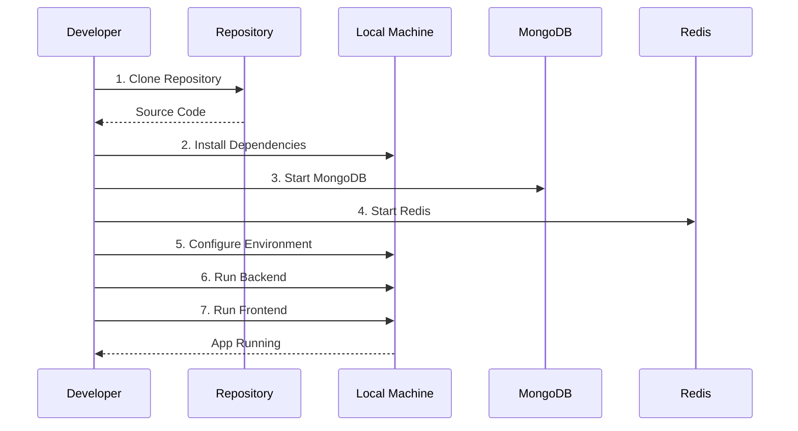

### Step-by-Step Instructions

#### 1. Clone Repository

```bash
git clone https://github.com/hoangsonww/Learning-Management-System-Fullstack.git
cd Learning-Management-System-Fullstack
```

#### 2. Backend Setup

```bash
# Navigate to backend
cd LMS-Backend

# Create virtual environment
python -m venv .venv
source .venv/bin/activate  # On Windows: .venv\Scripts\activate

# Install dependencies
pip install -r requirements.txt

# Configure environment
cp .env.example .env
# Edit .env with your settings

# Run migrations
python manage.py makemigrations
python manage.py migrate

# Create superuser
python manage.py createsuperuser

# Seed sample data (optional)
python manage.py seed_sample_data

# Start backend server
python manage.py runserver
```

Backend will be available at `http://localhost:8000`

#### 3. Frontend Setup

```bash
# Navigate to frontend (new terminal)
cd LMS-Frontend/app

# Install dependencies
npm install

# Start development server
ng serve
```

Frontend will be available at `http://localhost:4200`

#### 4. Verify Deployment

- Frontend: http://localhost:4200
- Backend API: http://localhost:8000
- Admin Panel: http://localhost:8000/admin
- API Docs: http://localhost:8000/swagger

---

## Docker Compose Deployment

### Architecture

```mermaid
graph TB
    subgraph "Docker Compose Stack"
        subgraph "Frontend Service"
            ANGULAR[Angular App<br/>Port 8080]
        end

        subgraph "Backend Service"
            DJANGO[Django API<br/>Port 8000]
        end

        subgraph "Database Service"
            MONGO[MongoDB<br/>Port 27017]
        end

        subgraph "Cache Service"
            REDIS[Redis<br/>Port 6379]
        end

        subgraph "Reverse Proxy"
            NGINX[NGINX<br/>Port 80/443]
        end
    end

    NGINX --> ANGULAR
    NGINX --> DJANGO
    DJANGO --> MONGO
    DJANGO --> REDIS

    style NGINX fill:#009639
    style ANGULAR fill:#DD0031
    style DJANGO fill:#092E20
    style MONGO fill:#47A248
    style REDIS fill:#DC382D
```

### Deployment Steps

#### 1. Configure Environment

Create `.env` file in project root:

```env
# Django Configuration
DJANGO_SECRET_KEY=your-secret-key-here
DJANGO_DEBUG=False
DJANGO_ALLOWED_HOSTS=localhost,127.0.0.1

# MongoDB Configuration
MONGO_HOST=mongodb
MONGO_PORT=27017
MONGO_DB_NAME=lms_database
MONGO_DB_USERNAME=lmsuser
MONGO_DB_PASSWORD=secure-password-here

# Redis Configuration
REDIS_HOST=redis
REDIS_PORT=6379

# Application URLs
BACKEND_URL=http://localhost:8000
FRONTEND_URL=http://localhost:4200
```

#### 2. Build and Run

```bash
# Build and start all services
docker-compose up --build

# Run in detached mode
docker-compose up -d

# View logs
docker-compose logs -f

# Stop services
docker-compose down

# Remove volumes (clean slate)
docker-compose down -v
```

#### 3. Access Services

- Frontend: http://localhost:8080
- Backend API: http://localhost:8000
- MongoDB: localhost:27017
- Redis: localhost:6379

#### 4. Production Considerations

```yaml
# docker-compose.prod.yml
version: '3.8'

services:
  backend:
    restart: always
    environment:
      - DJANGO_DEBUG=False
    deploy:
      resources:
        limits:
          cpus: '1'
          memory: 1G

  frontend:
    restart: always
    deploy:
      resources:
        limits:
          cpus: '0.5'
          memory: 512M

  mongodb:
    restart: always
    volumes:
      - mongodb_data:/data/db
      - ./backups:/backups
    deploy:
      resources:
        limits:
          cpus: '2'
          memory: 2G

  redis:
    restart: always
    command: redis-server --appendonly yes
    volumes:
      - redis_data:/data
```

Run production compose:

```bash
docker-compose -f docker-compose.yml -f docker-compose.prod.yml up -d
```

---

## Kubernetes Deployment

### Cluster Architecture

```mermaid
graph TB
    subgraph "Kubernetes Cluster"
        subgraph "Ingress Layer"
            ING[Ingress Controller<br/>NGINX/Traefik]
            CERT[cert-manager<br/>SSL Certificates]
        end

        subgraph "Application Layer"
            subgraph "Frontend"
                FE_DEP[Deployment<br/>3 Replicas]
                FE_SVC[Service<br/>ClusterIP]
                FE_HPA[HPA<br/>Auto-scaling]
            end

            subgraph "Backend"
                BE_DEP[Deployment<br/>3 Replicas]
                BE_SVC[Service<br/>ClusterIP]
                BE_HPA[HPA<br/>Auto-scaling]
            end
        end

        subgraph "Data Layer"
            MONGO_SS[MongoDB<br/>StatefulSet]
            MONGO_SVC[MongoDB<br/>Headless Service]
            MONGO_PVC[PersistentVolumeClaim]

            REDIS_DEP[Redis<br/>Deployment]
            REDIS_SVC[Redis Service]
        end

        subgraph "Configuration"
            CM[ConfigMap<br/>App Config]
            SEC[Secrets<br/>Credentials]
        end
    end

    ING --> FE_SVC
    ING --> BE_SVC
    CERT --> ING

    FE_SVC --> FE_DEP
    BE_SVC --> BE_DEP

    FE_HPA --> FE_DEP
    BE_HPA --> BE_DEP

    BE_DEP --> MONGO_SVC
    BE_DEP --> REDIS_SVC

    MONGO_SVC --> MONGO_SS
    MONGO_SS --> MONGO_PVC

    REDIS_SVC --> REDIS_DEP

    CM --> FE_DEP
    CM --> BE_DEP
    SEC --> BE_DEP

    style ING fill:#326CE5
    style FE_DEP fill:#DD0031
    style BE_DEP fill:#092E20
    style MONGO_SS fill:#47A248
    style REDIS_DEP fill:#DC382D
```

### Prerequisites

```bash
# Verify kubectl
kubectl version --client

# Verify cluster access
kubectl cluster-info

# Create namespace
kubectl create namespace lms-production
```

### Deployment Steps

#### 1. Configure Secrets

```bash
# Create secret for MongoDB
kubectl create secret generic mongodb-secret \
  --from-literal=username=lmsadmin \
  --from-literal=password=secure-password \
  -n lms-production

# Create secret for Django
kubectl create secret generic django-secret \
  --from-literal=secret-key=your-django-secret-key \
  -n lms-production
```

#### 2. Deploy ConfigMap

```bash
cd kubernetes
kubectl apply -f configmap.yaml -n lms-production
```

#### 3. Deploy MongoDB

```bash
kubectl apply -f mongodb-statefulset.yaml -n lms-production
kubectl apply -f mongodb-service.yaml -n lms-production

# Wait for MongoDB to be ready
kubectl wait --for=condition=ready pod -l app=mongodb -n lms-production --timeout=300s
```

#### 4. Deploy Redis

```bash
kubectl apply -f redis-deployment.yaml -n lms-production
kubectl apply -f redis-service.yaml -n lms-production
```

#### 5. Deploy Backend

```bash
kubectl apply -f backend-deployment.yaml -n lms-production
kubectl apply -f backend-service.yaml -n lms-production

# Wait for backend pods
kubectl wait --for=condition=ready pod -l app=backend -n lms-production --timeout=300s
```

#### 6. Deploy Frontend

```bash
kubectl apply -f frontend-deployment.yaml -n lms-production
kubectl apply -f frontend-service.yaml -n lms-production
```

#### 7. Deploy Ingress

```bash
# Install ingress controller (if not installed)
kubectl apply -f https://raw.githubusercontent.com/kubernetes/ingress-nginx/controller-v1.8.1/deploy/static/provider/cloud/deploy.yaml

# Deploy ingress resource
kubectl apply -f ingress.yaml -n lms-production

# Get ingress IP
kubectl get ingress -n lms-production
```

### Scaling

```bash
# Manual scaling
kubectl scale deployment backend --replicas=5 -n lms-production

# Enable auto-scaling
kubectl autoscale deployment backend \
  --cpu-percent=70 \
  --min=2 \
  --max=10 \
  -n lms-production
```

### Monitoring

```bash
# View pods
kubectl get pods -n lms-production

# View logs
kubectl logs -f deployment/backend -n lms-production

# Describe pod
kubectl describe pod <pod-name> -n lms-production

# Execute command in pod
kubectl exec -it <pod-name> -n lms-production -- /bin/bash
```

---

## AWS Production Deployment

### Infrastructure Overview

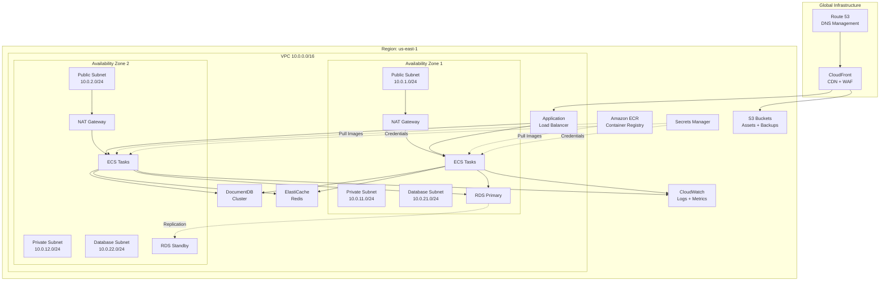

### Deployment Workflow

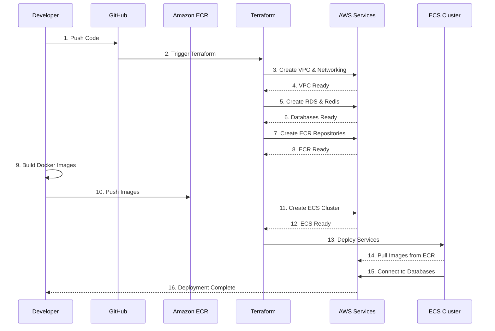

### Quick Deploy with AWS Scripts

#### 1. Prerequisites Setup

```bash
# Install AWS CLI
curl "https://awscli.amazonaws.com/AWSCLIV2.pkg" -o "AWSCLIV2.pkg"
sudo installer -pkg AWSCLIV2.pkg -target /

# Configure AWS credentials
aws configure
# AWS Access Key ID: YOUR_ACCESS_KEY
# AWS Secret Access Key: YOUR_SECRET_KEY
# Default region: us-east-1
# Default output format: json

# Verify configuration
aws sts get-caller-identity
```

#### 2. Set Environment Variables

```bash
export AWS_REGION=us-east-1
export ENVIRONMENT=production
export PROJECT_NAME=lms
export DOMAIN_NAME=yourdomain.com  # Optional
```

#### 3. Deploy Infrastructure

```bash
cd aws/scripts

# Make scripts executable
chmod +x *.sh

# Deploy all infrastructure
./deploy.sh

# This will:
# - Create VPC and networking
# - Set up RDS PostgreSQL
# - Create ElastiCache Redis
# - Deploy ECS cluster
# - Configure ALB
# - Build and push Docker images
# - Deploy ECS services
```

#### 4. Verify Deployment

```bash
# Check ECS services
aws ecs list-services --cluster lms-production-cluster

# Check ALB
aws elbv2 describe-load-balancers --names lms-production-alb

# Get application URL
aws elbv2 describe-load-balancers \
  --names lms-production-alb \
  --query 'LoadBalancers[0].DNSName' \
  --output text
```

### Manual Rollback

```bash
cd aws/scripts
./rollback.sh
```

---

## Terraform Infrastructure

### Infrastructure Components

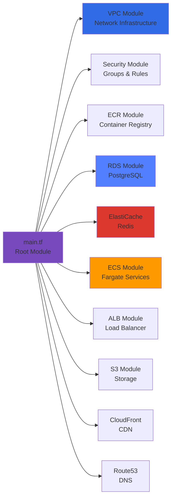

### Terraform Deployment Steps

#### 1. Initialize Terraform Backend

```bash
# Create S3 bucket for state
AWS_ACCOUNT_ID=$(aws sts get-caller-identity --query Account --output text)
aws s3 mb s3://lms-terraform-state-${AWS_ACCOUNT_ID} --region us-east-1

# Enable versioning
aws s3api put-bucket-versioning \
  --bucket lms-terraform-state-${AWS_ACCOUNT_ID} \
  --versioning-configuration Status=Enabled

# Create DynamoDB table for state locking
aws dynamodb create-table \
  --table-name lms-terraform-locks \
  --attribute-definitions AttributeName=LockID,AttributeType=S \
  --key-schema AttributeName=LockID,KeyType=HASH \
  --billing-mode PAY_PER_REQUEST \
  --region us-east-1
```

#### 2. Configure Variables

```bash
cd terraform

# Copy example variables
cp terraform.tfvars.example terraform.tfvars

# Edit variables
vim terraform.tfvars
```

Example `terraform.tfvars`:

```hcl
project_name = "lms"
environment  = "production"
aws_region   = "us-east-1"

vpc_cidr = "10.0.0.0/16"
availability_zones = ["us-east-1a", "us-east-1b", "us-east-1c"]

ecs_backend_cpu    = 512
ecs_backend_memory = 1024
ecs_backend_count  = 2

ecs_frontend_cpu    = 256
ecs_frontend_memory = 512
ecs_frontend_count  = 2

rds_instance_class = "db.t3.medium"
redis_node_type    = "cache.t3.medium"

domain_name = "yourdomain.com"
create_route53_zone = true
enable_cloudfront = true

tags = {
  Project     = "Learning Management System"
  Environment = "production"
  ManagedBy   = "Terraform"
}
```

#### 3. Initialize and Plan

```bash
# Initialize Terraform
terraform init

# Validate configuration
terraform validate

# Format code
terraform fmt -recursive

# Plan deployment
terraform plan -out=tfplan

# Review plan output carefully
```

#### 4. Apply Infrastructure

```bash
# Apply plan
terraform apply tfplan

# Or apply directly (not recommended for production)
terraform apply -auto-approve
```

This will take 15-30 minutes to complete.

#### 5. Get Outputs

```bash
# View all outputs
terraform output

# Get specific output
terraform output alb_dns_name

# Export outputs to environment variables
export ALB_DNS=$(terraform output -raw alb_dns_name)
export ECR_BACKEND=$(terraform output -raw ecr_backend_repository_url)
export ECR_FRONTEND=$(terraform output -raw ecr_frontend_repository_url)
```

#### 6. Build and Push Images

```bash
# Login to ECR
aws ecr get-login-password --region us-east-1 | \
  docker login --username AWS --password-stdin $ECR_BACKEND

# Build backend
cd ../../LMS-Backend
docker build -t lms-backend:latest .
docker tag lms-backend:latest ${ECR_BACKEND}:latest
docker push ${ECR_BACKEND}:latest

# Build frontend
cd ../LMS-Frontend
docker build -t lms-frontend:latest .
docker tag lms-frontend:latest ${ECR_FRONTEND}:latest
docker push ${ECR_FRONTEND}:latest
```

#### 7. Update ECS Services

```bash
# Force new deployment
aws ecs update-service \
  --cluster lms-production-cluster \
  --service lms-production-backend-service \
  --force-new-deployment

aws ecs update-service \
  --cluster lms-production-cluster \
  --service lms-production-frontend-service \
  --force-new-deployment

# Wait for services to stabilize
aws ecs wait services-stable \
  --cluster lms-production-cluster \
  --services lms-production-backend-service lms-production-frontend-service
```

### Environment Management

```bash
# Development environment
cd terraform/environments/dev
terraform init
terraform apply -var-file=terraform.tfvars

# Staging environment
cd terraform/environments/staging
terraform init
terraform apply -var-file=terraform.tfvars

# Production environment
cd terraform/environments/production
terraform init
terraform apply -var-file=terraform.tfvars
```

### Infrastructure Updates

```bash
# Update specific module
terraform apply -target=module.ecs

# Refresh state
terraform refresh

# Import existing resource
terraform import module.vpc.aws_vpc.main vpc-xxxxx

# Destroy specific resource
terraform destroy -target=module.s3
```

### State Management

```bash
# List state resources
terraform state list

# Show specific resource
terraform state show module.vpc.aws_vpc.main

# Move resource
terraform state mv module.old.resource module.new.resource

# Remove resource from state
terraform state rm module.resource

# Pull remote state
terraform state pull > terraform.tfstate.backup
```

---

## CI/CD Pipeline Setup

### GitHub Actions Workflow

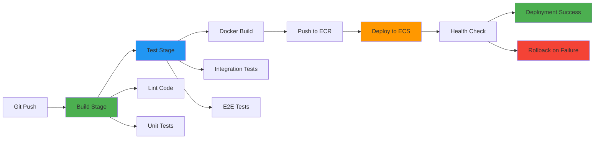

### GitHub Actions Configuration

Create `.github/workflows/deploy.yml`:

```yaml
name: Deploy to AWS

on:
  push:
    branches: [main, master]
  pull_request:
    branches: [main, master]

env:
  AWS_REGION: us-east-1
  ECR_BACKEND_REPOSITORY: lms-backend
  ECR_FRONTEND_REPOSITORY: lms-frontend
  ECS_CLUSTER: lms-production-cluster
  ECS_BACKEND_SERVICE: lms-production-backend-service
  ECS_FRONTEND_SERVICE: lms-production-frontend-service

jobs:
  test:
    runs-on: ubuntu-latest
    steps:
      - uses: actions/checkout@v3

      - name: Set up Python
        uses: actions/setup-python@v4
        with:
          python-version: '3.12'

      - name: Install backend dependencies
        run: |
          cd LMS-Backend
          pip install -r requirements.txt

      - name: Run backend tests
        run: |
          cd LMS-Backend
          pytest

      - name: Set up Node.js
        uses: actions/setup-node@v3
        with:
          node-version: '18'

      - name: Install frontend dependencies
        run: |
          cd LMS-Frontend/app
          npm install

      - name: Run frontend tests
        run: |
          cd LMS-Frontend/app
          npm run test:ci

  build-and-deploy:
    needs: test
    runs-on: ubuntu-latest
    if: github.ref == 'refs/heads/main'

    steps:
      - uses: actions/checkout@v3

      - name: Configure AWS credentials
        uses: aws-actions/configure-aws-credentials@v2
        with:
          aws-access-key-id: ${{ secrets.AWS_ACCESS_KEY_ID }}
          aws-secret-access-key: ${{ secrets.AWS_SECRET_ACCESS_KEY }}
          aws-region: ${{ env.AWS_REGION }}

      - name: Login to Amazon ECR
        id: login-ecr
        uses: aws-actions/amazon-ecr-login@v1

      - name: Build, tag, and push backend image
        env:
          ECR_REGISTRY: ${{ steps.login-ecr.outputs.registry }}
          IMAGE_TAG: ${{ github.sha }}
        run: |
          cd LMS-Backend
          docker build -t $ECR_REGISTRY/$ECR_BACKEND_REPOSITORY:$IMAGE_TAG .
          docker tag $ECR_REGISTRY/$ECR_BACKEND_REPOSITORY:$IMAGE_TAG $ECR_REGISTRY/$ECR_BACKEND_REPOSITORY:latest
          docker push $ECR_REGISTRY/$ECR_BACKEND_REPOSITORY:$IMAGE_TAG
          docker push $ECR_REGISTRY/$ECR_BACKEND_REPOSITORY:latest

      - name: Build, tag, and push frontend image
        env:
          ECR_REGISTRY: ${{ steps.login-ecr.outputs.registry }}
          IMAGE_TAG: ${{ github.sha }}
        run: |
          cd LMS-Frontend
          docker build -t $ECR_REGISTRY/$ECR_FRONTEND_REPOSITORY:$IMAGE_TAG .
          docker tag $ECR_REGISTRY/$ECR_FRONTEND_REPOSITORY:$IMAGE_TAG $ECR_REGISTRY/$ECR_FRONTEND_REPOSITORY:latest
          docker push $ECR_REGISTRY/$ECR_FRONTEND_REPOSITORY:$IMAGE_TAG
          docker push $ECR_REGISTRY/$ECR_FRONTEND_REPOSITORY:latest

      - name: Deploy to ECS
        run: |
          aws ecs update-service --cluster $ECS_CLUSTER --service $ECS_BACKEND_SERVICE --force-new-deployment
          aws ecs update-service --cluster $ECS_CLUSTER --service $ECS_FRONTEND_SERVICE --force-new-deployment

      - name: Wait for deployment
        run: |
          aws ecs wait services-stable --cluster $ECS_CLUSTER --services $ECS_BACKEND_SERVICE $ECS_FRONTEND_SERVICE

      - name: Verify deployment
        run: |
          # Add health check verification here
          echo "Deployment verified successfully"
```

### Jenkins Pipeline

Create `Jenkinsfile`:

```groovy
pipeline {
    agent any

    environment {
        AWS_REGION = 'us-east-1'
        ECR_BACKEND_REPO = 'lms-backend'
        ECR_FRONTEND_REPO = 'lms-frontend'
        ECS_CLUSTER = 'lms-production-cluster'
    }

    stages {
        stage('Checkout') {
            steps {
                checkout scm
            }
        }

        stage('Test Backend') {
            steps {
                dir('LMS-Backend') {
                    sh 'pip install -r requirements.txt'
                    sh 'pytest'
                }
            }
        }

        stage('Test Frontend') {
            steps {
                dir('LMS-Frontend/app') {
                    sh 'npm install'
                    sh 'npm run test:ci'
                }
            }
        }

        stage('Build Docker Images') {
            parallel {
                stage('Build Backend') {
                    steps {
                        dir('LMS-Backend') {
                            script {
                                docker.build("${ECR_BACKEND_REPO}:${BUILD_NUMBER}")
                            }
                        }
                    }
                }
                stage('Build Frontend') {
                    steps {
                        dir('LMS-Frontend') {
                            script {
                                docker.build("${ECR_FRONTEND_REPO}:${BUILD_NUMBER}")
                            }
                        }
                    }
                }
            }
        }

        stage('Push to ECR') {
            steps {
                script {
                    docker.withRegistry("https://${AWS_ACCOUNT_ID}.dkr.ecr.${AWS_REGION}.amazonaws.com", 'ecr:us-east-1:aws-credentials') {
                        docker.image("${ECR_BACKEND_REPO}:${BUILD_NUMBER}").push()
                        docker.image("${ECR_FRONTEND_REPO}:${BUILD_NUMBER}").push()
                    }
                }
            }
        }

        stage('Deploy to ECS') {
            steps {
                sh """
                    aws ecs update-service --cluster ${ECS_CLUSTER} --service lms-backend-service --force-new-deployment
                    aws ecs update-service --cluster ${ECS_CLUSTER} --service lms-frontend-service --force-new-deployment
                """
            }
        }

        stage('Verify Deployment') {
            steps {
                sh """
                    aws ecs wait services-stable --cluster ${ECS_CLUSTER} --services lms-backend-service lms-frontend-service
                """
            }
        }
    }

    post {
        success {
            echo 'Deployment successful!'
            // Send notification
        }
        failure {
            echo 'Deployment failed!'
            // Trigger rollback
            // Send alert
        }
    }
}
```

---

## Monitoring & Maintenance

### CloudWatch Dashboards

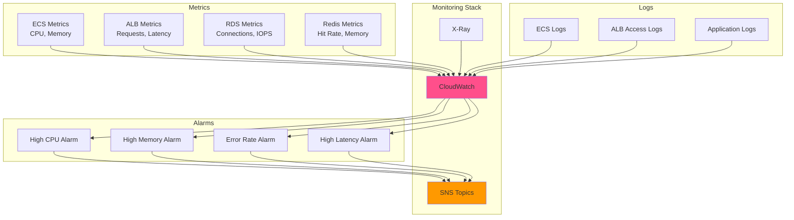

### Monitoring Commands

```bash
# View ECS service metrics
aws cloudwatch get-metric-statistics \
  --namespace AWS/ECS \
  --metric-name CPUUtilization \
  --dimensions Name=ServiceName,Value=lms-backend-service Name=ClusterName,Value=lms-production-cluster \
  --start-time 2025-01-01T00:00:00Z \
  --end-time 2025-01-02T00:00:00Z \
  --period 3600 \
  --statistics Average

# View logs
aws logs tail /ecs/lms-production/backend --follow

# Create alarm
aws cloudwatch put-metric-alarm \
  --alarm-name lms-high-cpu \
  --alarm-description "Alarm when CPU exceeds 80%" \
  --metric-name CPUUtilization \
  --namespace AWS/ECS \
  --statistic Average \
  --period 300 \
  --threshold 80 \
  --comparison-operator GreaterThanThreshold \
  --evaluation-periods 2
```

### Backup Procedures

```bash
# Backup RDS
aws rds create-db-snapshot \
  --db-instance-identifier lms-production-db \
  --db-snapshot-identifier lms-backup-$(date +%Y%m%d-%H%M%S)

# Backup DocumentDB
aws docdb create-db-cluster-snapshot \
  --db-cluster-identifier lms-production-docdb \
  --db-cluster-snapshot-identifier lms-docdb-backup-$(date +%Y%m%d-%H%M%S)

# Backup Redis (if not using AWS Backup)
aws elasticache create-snapshot \
  --replication-group-id lms-production-redis \
  --snapshot-name lms-redis-backup-$(date +%Y%m%d-%H%M%S)
```

---

## Troubleshooting

### Common Issues and Solutions

#### ECS Tasks Not Starting

```bash
# Check task logs
aws ecs describe-tasks \
  --cluster lms-production-cluster \
  --tasks $(aws ecs list-tasks --cluster lms-production-cluster --query 'taskArns[0]' --output text)

# Check CloudWatch logs
aws logs tail /ecs/lms-production/backend --since 1h

# Common causes:
# - Incorrect environment variables
# - Missing secrets in Secrets Manager
# - Insufficient IAM permissions
# - Image pull errors
```

#### Database Connection Issues

```bash
# Test RDS connectivity
aws rds describe-db-instances \
  --db-instance-identifier lms-production-db \
  --query 'DBInstances[0].Endpoint'

# Check security groups
aws ec2 describe-security-groups \
  --group-ids sg-xxxxx

# Verify from ECS task
aws ecs execute-command \
  --cluster lms-production-cluster \
  --task task-id \
  --container backend \
  --interactive \
  --command "pg_isready -h rds-endpoint -p 5432"
```

#### High Costs

```bash
# Analyze costs by service
aws ce get-cost-and-usage \
  --time-period Start=2025-01-01,End=2025-01-31 \
  --granularity MONTHLY \
  --metrics BlendedCost \
  --group-by Type=SERVICE

# Common cost optimizations:
# - Use Reserved Instances for RDS
# - Optimize ECS task sizes
# - Enable S3 lifecycle policies
# - Use single NAT Gateway for non-prod
# - Stop non-prod environments after hours
```

---

## Cost Estimation

### Production Monthly Costs

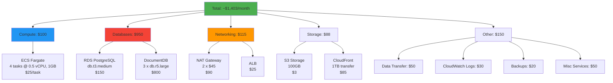

### Cost Optimization Tips

1. **Use Reserved Instances** (40-60% savings)
   - RDS Reserved Instances
   - ElastiCache Reserved Nodes
   - Compute Savings Plans

2. **Optimize Compute Resources**
   - Right-size ECS tasks
   - Use Spot Instances for non-critical workloads
   - Enable auto-scaling to match demand

3. **Storage Optimization**
   - S3 Lifecycle policies (move to Glacier)
   - Delete old CloudWatch logs
   - Compress database backups

4. **Network Optimization**
   - Use VPC Endpoints for S3/DynamoDB
   - Single NAT Gateway for non-prod
   - CloudFront to reduce data transfer costs

5. **Monitoring & Budgets**
   - Set up AWS Budgets
   - Enable Cost Explorer
   - Regular cost reviews

---

## Security Best Practices

### Security Checklist

```mermaid
graph TB
    SEC[Security Measures]

    SEC --> NET[Network Security]
    SEC --> DATA[Data Security]
    SEC --> ACCESS[Access Control]
    SEC --> APP[Application Security]
    SEC --> MONITOR[Monitoring]

    NET --> VPC[Private Subnets]
    NET --> SG[Security Groups]
    NET --> NACL[NACLs]
    NET --> WAF_SEC[WAF Rules]

    DATA --> ENCRYPT[Encryption at Rest]
    DATA --> TLS[TLS in Transit]
    DATA --> KMS_SEC[KMS Keys]
    DATA --> BACKUP_SEC[Encrypted Backups]

    ACCESS --> IAM[IAM Roles]
    ACCESS --> MFA[MFA Enabled]
    ACCESS --> LEAST[Least Privilege]
    ACCESS --> SECRETS[Secrets Manager]

    APP --> VULN[Vulnerability Scanning]
    APP --> DEPS[Dependency Updates]
    APP --> CODE_SEC[Code Review]
    APP --> OWASP[OWASP Top 10]

    MONITOR --> TRAIL[CloudTrail]
    MONITOR --> GUARD[GuardDuty]
    MONITOR --> CONFIG[AWS Config]
    MONITOR --> ALERTS[Security Alerts]

    style SEC fill:#F44336
    style NET fill:#4CAF50
    style DATA fill:#2196F3
    style ACCESS fill:#FF9800
    style APP fill:#9C27B0
    style MONITOR fill:#00BCD4
```

### Implementation

1. **Enable Encryption**
   ```bash
   # RDS encryption
   --storage-encrypted \
   --kms-key-id arn:aws:kms:region:account:key/key-id

   # S3 encryption
   --server-side-encryption aws:kms
   ```

2. **Configure Security Groups**
   ```bash
   # Allow only necessary traffic
   # Backend security group
   aws ec2 authorize-security-group-ingress \
     --group-id sg-backend \
     --protocol tcp \
     --port 8000 \
     --source-group sg-alb

   # Database security group
   aws ec2 authorize-security-group-ingress \
     --group-id sg-rds \
     --protocol tcp \
     --port 5432 \
     --source-group sg-backend
   ```

3. **Enable CloudTrail**
   ```bash
   aws cloudtrail create-trail \
     --name lms-audit-trail \
     --s3-bucket-name lms-cloudtrail-logs
   ```

4. **Regular Security Audits**
   - Review IAM policies monthly
   - Update dependencies weekly
   - Scan containers for vulnerabilities
   - Penetration testing quarterly

---

## Support and Resources

### Getting Help

- **Documentation**: [Project README](README.md)
- **Issues**: [GitHub Issues](https://github.com/hoangsonww/Learning-Management-System-Fullstack/issues)
- **Email**: hoangson091104@gmail.com
- **Architecture**: [ARCHITECTURE.md](ARCHITECTURE.md)

### Additional Resources

- [AWS Well-Architected Framework](https://aws.amazon.com/architecture/well-architected/)
- [Terraform AWS Provider Docs](https://registry.terraform.io/providers/hashicorp/aws/latest/docs)
- [Kubernetes Documentation](https://kubernetes.io/docs/home/)
- [Docker Documentation](https://docs.docker.com/)
- [ECS Best Practices](https://docs.aws.amazon.com/AmazonECS/latest/bestpracticesguide/)

---

**Last Updated**: 2025-10-08
**Version**: 1.0.0
**Maintained By**: Son Nguyen

---

[⬆ Back to Top](#learning-management-system---deployment-guide)
