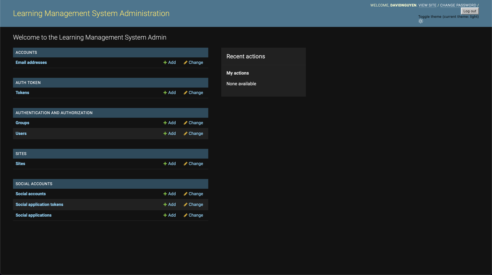
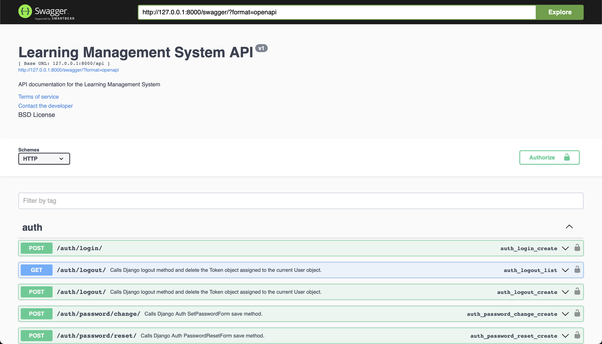
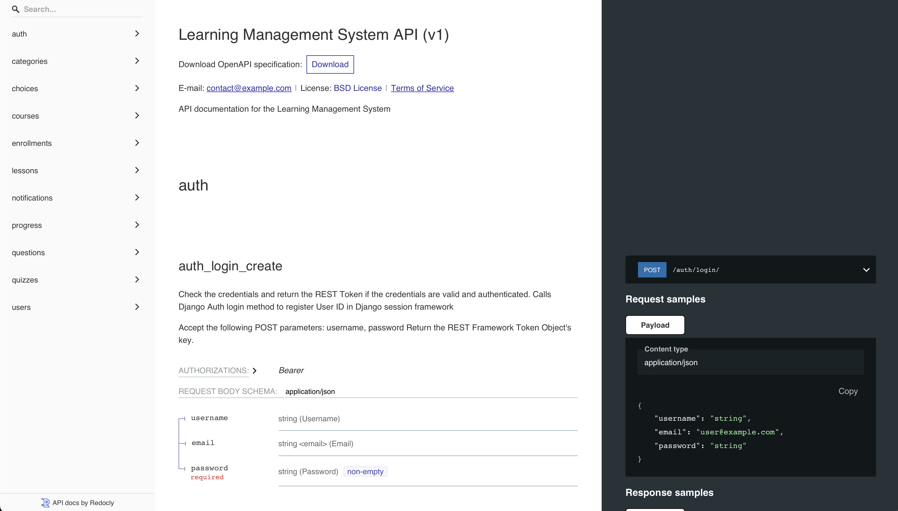
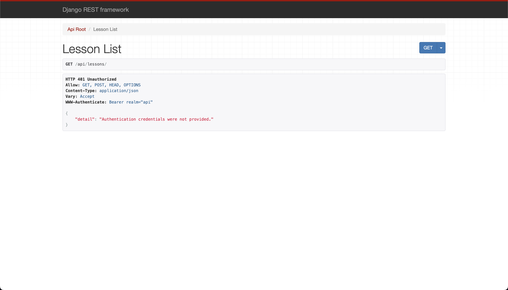
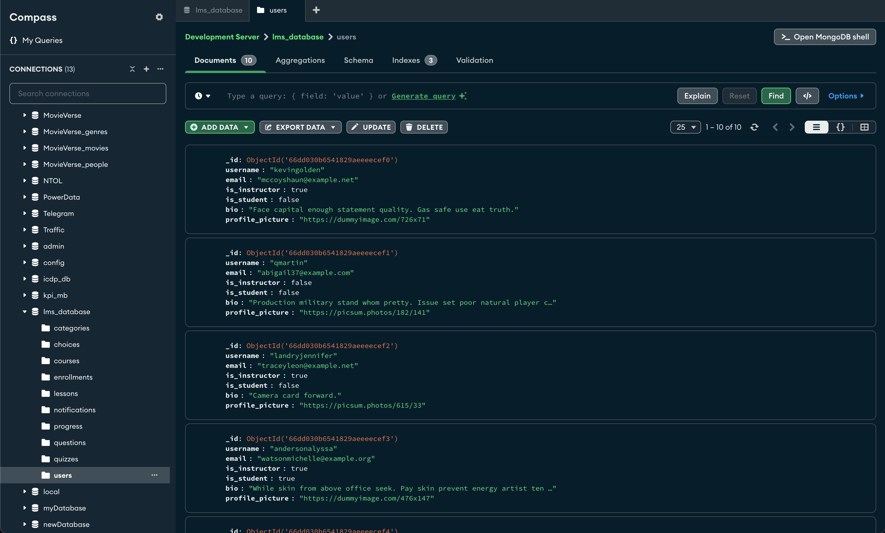

# Learning Management System Backend

This is the backend of a Learning Management System (LMS) built using Django and Django REST Framework. The backend provides a comprehensive REST API to manage users, courses, categories, lessons, quizzes, questions, choices, enrollments, progress, and notifications.

## Table of Contents

- [Prerequisites](#prerequisites)
- [Setup Instructions](#setup-instructions)
- [Running the Server](#running-the-server)
- [Using the Admin Interface](#using-the-admin-interface)
- [API Endpoints](#api-endpoints)
- [File Structure](#file-structure)
- [Authentication](#authentication)
- [Testing the APIs](#testing-the-apis)
  - [Using `curl`](#using-curl)
  - [Using Postman](#using-postman)
  - [Using Swagger UI](#using-swagger-ui)
  - [Using Redoc](#using-redoc)
  - [Using Django REST Framework Browsable API](#using-django-rest-framework-browsable-api)
- [Seeding Sample Data](#seeding-sample-data)
- [Recommended GUI Tools](#recommended-gui-tools)

## Prerequisites

- Python 3.6 or higher
- MongoDB running locally or remotely
- Redis running locally or remotely
- Django 3.0 or higher

## Setup Instructions

1. **Clone the Repository**

   ```bash
   git clone https://github.com/hoangsonww/Fullstack-Learning-Management-System.git
   cd Fullstack-Learning-Management-System/LMS-Backend
   ```

2. **Create and Activate a Virtual Environment**

   ```bash
   python -m venv .venv
   # On Windows
   .venv\Scripts\activate
   # On macOS/Linux
   source .venv/bin/activate
   ```

3. **Install Required Packages**

   ```bash
   pip install -r requirements.txt
   ```

4. **Configure MongoDB and Redis**

   - Make sure MongoDB and Redis are running on your machine or have the correct connection strings in `settings.py`.
   
   - If you don't have MongoDB and Redis installed, run the following commands to install them:
     - For MacOS/Linux:
       ```bash
       brew tap mongodb/brew
       brew install mongodb-community
       brew services start mongodb-community
       brew install redis
       redis-server
       ```  
       
     - For Windows:
       - Download and install MongoDB from [here](https://www.mongodb.com/try/download/community).
       - Download and install Redis from [here](https://redis.io/download).

5. **Apply Migrations**

   Make sure all migrations are applied:

   ```bash
   python manage.py makemigrations
   python manage.py migrate
   ```

6. **Create a Superuser**

   To access the Django admin interface, you need to create a superuser:

   ```bash
   python manage.py createsuperuser
   ```

   Follow the prompts to set up the username, email, and password. 
   Be sure to store or remember these credentials for later use. You will need them to log in to the admin interface and test the API endpoints

7. **Seed Sample Data**

   Run the following command to seed the database with sample data:

   ```bash
   python manage.py seed_sample_data
   ```

## Running the Server

Start the Django development server:

```bash
python manage.py runserver
```

The server will start at `http://127.0.0.1:8000/`.

## Using the Admin Interface

To use the Django admin interface:

1. Go to [http://127.0.0.1:8000/admin/](http://127.0.0.1:8000/admin/).
2. Log in using the superuser credentials you created.
3. You can manage users, courses, categories, lessons, quizzes, questions, choices, enrollments, progress, and notifications directly from the admin interface.

Here is how the admin interface looks like:

<p align="center" style="cursor: pointer">
  
</p>

## API Endpoints

| Endpoint                   | Method | Description                                   |
|----------------------------|--------|-----------------------------------------------|
| `/api/users/`              | GET    | Retrieve a list of all users.                 |
| `/api/users/{id}/`         | GET    | Retrieve a specific user instance.            |
| `/api/users/`              | POST   | Create a new user instance.                   |
| `/api/users/{id}/`         | PUT    | Update a specific user instance.              |
| `/api/users/{id}/`         | DELETE | Delete a specific user instance.              |
| `/api/courses/`            | GET    | Retrieve a list of all courses.               |
| `/api/courses/{id}/`       | GET    | Retrieve a specific course instance.          |
| `/api/courses/`            | POST   | Create a new course instance.                 |
| `/api/courses/{id}/`       | PUT    | Update a specific course instance.            |
| `/api/courses/{id}/`       | DELETE | Delete a specific course instance.            |
| `/api/categories/`         | GET    | Retrieve a list of all categories.            |
| `/api/categories/{id}/`    | GET    | Retrieve a specific category instance.        |
| `/api/categories/`         | POST   | Create a new category instance.               |
| `/api/categories/{id}/`    | PUT    | Update a specific category instance.          |
| `/api/categories/{id}/`    | DELETE | Delete a specific category instance.          |
| `/api/lessons/`            | GET    | Retrieve a list of all lessons.               |
| `/api/lessons/{id}/`       | GET    | Retrieve a specific lesson instance.          |
| `/api/lessons/`            | POST   | Create a new lesson instance.                 |
| `/api/lessons/{id}/`       | PUT    | Update a specific lesson instance.            |
| `/api/lessons/{id}/`       | DELETE | Delete a specific lesson instance.            |
| `/api/quizzes/`            | GET    | Retrieve a list of all quizzes.               |
| `/api/quizzes/{id}/`       | GET    | Retrieve a specific quiz instance.            |
| `/api/quizzes/`            | POST   | Create a new quiz instance.                   |
| `/api/quizzes/{id}/`       | PUT    | Update a specific quiz instance.              |
| `/api/quizzes/{id}/`       | DELETE | Delete a specific quiz instance.              |
| `/api/questions/`          | GET    | Retrieve a list of all questions.             |
| `/api/questions/{id}/`     | GET    | Retrieve a specific question instance.        |
| `/api/questions/`          | POST   | Create a new question instance.               |
| `/api/questions/{id}/`     | PUT    | Update a specific question instance.          |
| `/api/questions/{id}/`     | DELETE | Delete a specific question instance.          |
| `/api/choices/`            | GET    | Retrieve a list of all choices.               |
| `/api/choices/{id}/`       | GET    | Retrieve a specific choice instance.          |
| `/api/choices/`            | POST   | Create a new choice instance.                 |
| `/api/choices/{id}/`       | PUT    | Update a specific choice instance.            |
| `/api/choices/{id}/`       | DELETE | Delete a specific choice instance.            |
| `/api/enrollments/`        | GET    | Retrieve a list of all enrollments.           |
| `/api/enrollments/{id}/`   | GET    | Retrieve a specific enrollment instance.      |
| `/api/enrollments/`        | POST   | Create a new enrollment instance.             |
| `/api/enrollments/{id}/`   | PUT    | Update a specific enrollment instance.        |
| `/api/enrollments/{id}/`   | DELETE | Delete a specific enrollment instance.        |
| `/api/progress/`           | GET    | Retrieve a list of all progress records.      |
| `/api/progress/{id}/`      | GET    | Retrieve a specific progress record instance. |
| `/api/progress/`           | POST   | Create a new progress record instance.        |
| `/api/progress/{id}/`      | PUT    | Update a specific progress record instance.   |
| `/api/progress/{id}/`      | DELETE | Delete a specific progress record instance.   |
| `/api/notifications/`      | GET    | Retrieve a list of all notifications.         |
| `/api/notifications/{id}/` | GET    | Retrieve a specific notification instance.    |
| `/api/notifications/`      | POST   | Create a new notification instance.           |
| `/api/notifications/{id}/` | PUT    | Update a specific notification instance.      |
| `/api/notifications/{id}/` | DELETE | Delete a specific notification instance.      |

## File Structure

```plaintext
Learning-Management-System/
├── LMS-Backend
│   ├── manage.py
│   ├── requirements.txt
│   ├── LICENSE
│   ├── db.sqlite3
│   ├── README.md
│   ├── LMSBackend/
│   │   ├── settings.py
│   │   ├── urls.py
│   │   ├── asgi.py
│   │   └── wsgi.py
│   ├── core/
│   │   ├── management/
│   │   │   └── commands/
│   │   │       └── seed_sample_data.py
│   │   ├── migrations/
│   │   ├── models.py
│   │   ├── views.py
│   │   ├── tests.py
│   │   ├── admin.py
│   │   ├── apps.py
│   │   ├── serializers.py
│   │   └── urls.py
│   └── ...
├── LMS-Frontend
│   ├── (Frontend code)
│   └── ...
├── LICENSE
├── .gitignore
└── README.md
```

## Authentication

**Important**: Most API endpoints require authentication. You must first log in to obtain an authentication token.

1. **Log in to Get a Token**

   Use the `/api/auth/login/` endpoint to log in and get a token.

   ```bash
   curl -X POST http://127.0.0.1:8000/api/auth/login/ -H "Content-Type: application/json" -d '{
     "username": "your_username",
     "password": "your_password"
   }'
   ```
   
   Replace `your_username` and `your_password` with your superuser credentials.

   This will return a response with a token. You must include this token in the `Authorization` header as `Token <your_token_here>` for all subsequent API requests.

2. **Use the Token in API Requests**

   Include the token in the `Authorization` header:

   ```bash
   -H "Authorization: Token <your_token_here>"
   ```

## Testing the APIs

You can test the API using `curl`, Postman, or Swagger UI.

### Using `curl`

To test the API using `curl`, use the commands below. Replace `<your_token_here>` with the token obtained from the login endpoint.

- **List All Users**

  ```bash
  curl -X GET http://127.0.0.1:8000/api/users/ -H "Content-Type: application/json" -H "Authorization: Token <your_token_here>"
  ```
  
  - You should get something like this:
  
      ```json
      [
        {
          "id":"66dde39af395abfee65d1f86",
          "username":"gibsonstacey",
          "email":"xcaldwell@example.org",
          "is_instructor":false,"is_student":false,
          "bio":"Consider red specific within chance fund successful out.",
          "profile_picture":"https://placekitten.com/970/531"
        }
      ]
      ```

- **Create a New Course**

  ```bash
  curl -X POST http://127.0.0.1:8000/api/courses/ -H "Content-Type: application/json" -H "Authorization: Token <your_token_here>" -d '{
    "title": "New Course",
    "description": "This is a new course description.",
    "instructor": "{user_id}",
    "category": "{category_id}",
    "price": 150.00,
    "published": true
  }'
  ```

Repeat similar `curl` commands for other endpoints.

### Using Postman

1. Open Postman.
2. Create a new request for each endpoint.
3. Set the method (GET, POST, PUT, DELETE) and URL (e.g., `http://127.0.0.1:8000/api/users/`).
4. Under the "Authorization" tab, choose "Bearer Token" and paste your token.
5. Send the request and check the response.

### Using Swagger UI

1. Navigate to the Swagger UI at [http://127.0.0.1:8000/swagger/](http://127.0.0.1:8000/swagger/).
2. Click on an endpoint to expand it.
3. Click the "Try it out" button.
4. Enter the required parameters and authentication token (`Token <your_token_here>`) in the "Authorization" header. **Note that the token should be prefixed with `Token` and a space.**
5. Click "Execute" to see the API response.
6. Alternatively, you can simply click the "Authorize" button in the top right corner of the page and enter your token there. This will automatically include the token in all requests. Then repeat steps 3 and 5 to test the endpoints.

Here is how the Swagger UI looks like:

<p align="center" style="cursor: pointer">
  
</p>

### Using Redoc

1. Navigate to the Redoc UI at [http://127.0.0.1:8000/redoc/](http://127.0.1:8000/redoc/).
2. Click on an endpoint to expand it.
3. View the API documentation and test the endpoints.

Here is how the Redoc UI looks like:

<p align="center" style="cursor: pointer">
  
</p>

### Using Django REST Framework Browsable API

1. Choose any endpoint from the list above.
2. Navigate to the endpoint URL in your browser.
3. Log in using the superuser credentials.
4. You will see a browsable interface where you can view the details of the endpoint.

For example, to view the list of all lessons, go to [http://127.0.0.1:8000/api/lessons/](http://127.0.0.1:8000/api/lessons/). The interface should look like this:

<p align="center" style="cursor: pointer">
  
</p>

## Seeding Sample Data

If you want to seed the database with realistic sample data, you can also run the `seed_sample_data` management command:

```bash
python manage.py seed_sample_data
```

This command will populate the database with randomly generated users, courses, categories, lessons, quizzes, questions, choices, enrollments, progress records, and notifications.

**Note:** By default, the `seed_sample_data` command will be executed when you run the `python manage.py migrate` command. If you don't want to seed the database at that time, you can disable it by setting `SEED_SAMPLE_DATA_ON_MIGRATE = False` in the `settings.py` file.

## Recommended GUI Tools

- **MongoDB Compass**: A GUI tool for MongoDB that allows you to explore and interact with your MongoDB databases. You can download it from [here](https://www.mongodb.com/try/download/compass).
- **RedisInsight**: A GUI tool for Redis that allows you to explore and interact with your Redis databases. You can download it from [here](https://redislabs.com/redis-enterprise/redis-insight/).
- **Postman**: A powerful GUI tool for testing APIs. You can download it from [here](https://www.postman.com/downloads/).
- **Swagger UI**: An interactive API documentation tool. You can access the Swagger UI at [http://127.0.0.1:8000/swagger/](http://127.0.0.1:8000/swagger/). Ensure the server is running before accessing the UI.
- **Redoc**: Another interactive API documentation tool. You can access the Redoc UI at [http://127.0.0.1:8000/redoc/](http://127.0.0.1:8000/redoc/). Ensure the server is running before accessing the UI.

For example, you can use MongoDB Compass to view the data in your MongoDB database, RedisInsight to view the data in your Redis database, and Postman to test the API endpoints, like below:

<p align="center" style="cursor: pointer">
  
</p>

## License

This project is licensed under the MIT License. See the [LICENSE](LICENSE) file for more information.

In short, feel free to use, modify, and distribute this code for personal or commercial projects. I would appreciate it if you could provide attribution by linking back to this repository!

## Contact

If you have any questions or need further assistance, feel free to contact me at [hoangson091104@gmail.com](mailto:hoangson091104@gmail.com).

## Conclusion

With the setup complete, you can now fully explore and test the API endpoints of the Learning Management System backend using either `curl`, Postman, or the Swagger UI. Don't forget to authenticate first by logging in to obtain a token!

---

**[⬆ Back to Top](#learning-management-system-backend)**
