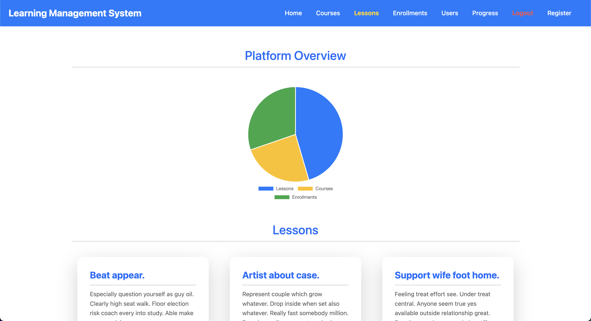

# E-Learning Management System Frontend

The **E-Learning Management System Frontend** is the frontend component of the E-Learning Management System, a web-based application that allows administrators and users to interact with the e-learning platform's various components. The frontend is developed with Angular, and the backend is built using Django REST Framework.

## Table of Contents

- [Project Overview](#project-overview)
- [Features](#features)
- [User Interfaces](#user-interfaces)
- [File Structure](#file-structure)
- [Getting Started](#getting-started)
  - [Prerequisites](#prerequisites)
  - [Backend Setup (Django)](#backend-setup)
  - [Frontend Setup (Angular)](#frontend-setup)
- [Styling and Design](#styling-and-design)
- [Troubleshooting](#troubleshooting)
- [Contributing](#contributing)
- [License](#license)
- [Contact](#contact)

## Project Overview

This frontend project is built with Angular, a popular web application framework developed by Google. It provides a user-friendly interface for managing courses, lessons, users, enrollments, and progress tracking. The frontend interacts with the backend APIs defined by Django to fetch and update data, handle user authentication, and display dynamic content.

## Features

- **User Authentication**: Token-based login system.
- **Course Management**: Display, create, update, and delete courses.
- **Lesson Management**: Display, create, update, and delete lessons.
- **User Management**: List and manage users.
- **Enrollment Management**: Handle course enrollments.
- **Progress Tracking**: Monitor user progress across lessons.
- **Responsive Design**: Optimized for various devices.
- **Charts and Data Visualization**: Implemented with Chart.js for dynamic data visualization.

## User Interfaces

**Home Page**:

<p align="center" style="cursor: pointer">
  
</p>

**Course List**:

<p align="center" style="cursor: pointer">
  
</p>

**Lesson List**:

<p align="center" style="cursor: pointer">
  
</p>

**User List**:

<p align="center" style="cursor: pointer">
  
</p>

**Enrollment List**:

<p align="center" style="cursor: pointer">
  
</p>

**Progress List**:

<p align="center" style="cursor: pointer">
  
</p>

**Login Page**:

<p align="center" style="cursor: pointer">
  
</p>

## File Structure

The repository is organized as follows:

```plaintext
Learning-Management-System/
├── LMS-Backend
│   ├── (Backend code)
│   └── ...
├── LMS-Frontend
│   ├── angular.json
│   ├── package.json
│   ├── README.md
│   ├── LICENSE
│   ├── app/
│   │   ├── src/
│   │   │   ├── app/
│   │   │   │   ├── auth/
│   │   │   │   │   ├── login/
│   │   │   │   │   │   ├── login.component.ts
│   │   │   │   │   │   ├── login.component.html
│   │   │   │   │   │   └── login.component.css
│   │   │   │   ├── core/
│   │   │   │   │   ├── footer/
│   │   │   │   │   │   ├── footer.component.ts
│   │   │   │   │   │   ├── footer.component.html
│   │   │   │   │   │   └── footer.component.css
│   │   │   │   │   ├── header/
│   │   │   │   │   │   ├── header.component.ts
│   │   │   │   │   │   ├── header.component.html
│   │   │   │   │   │   └── header.component.css
│   │   │   │   ├── pages/
│   │   │   │   │   ├── home/
│   │   │   │   │   │   ├── home.component.ts
│   │   │   │   │   │   ├── home.component.html
│   │   │   │   │   │   └── home.component.css
│   │   │   │   ├── components/
│   │   │   │   │   ├── course-list/
│   │   │   │   │   │   ├── course-list.component.ts
│   │   │   │   │   │   ├── course-list.component.html
│   │   │   │   │   │   └── course-list.component.css
│   │   │   │   │   ├── lesson-list/
│   │   │   │   │   │   ├── lesson-list.component.ts
│   │   │   │   │   │   ├── lesson-list.component.html
│   │   │   │   │   │   └── lesson-list.component.css
│   │   │   │   │   ├── user-list/
│   │   │   │   │   │   ├── user-list.component.ts
│   │   │   │   │   │   ├── user-list.component.html
│   │   │   │   │   │   └── user-list.component.css
│   │   │   │   │   ├── enrollment-list/
│   │   │   │   │   │   ├── enrollment-list.component.ts
│   │   │   │   │   │   ├── enrollment-list.component.html
│   │   │   │   │   │   └── enrollment-list.component.css
│   │   │   │   │   ├── progress-list/
│   │   │   │   │   │   ├── progress-list.component.ts
│   │   │   │   │   │   ├── progress-list.component.html
│   │   │   │   │   │   └── progress-list.component.css
│   │   │   │   ├── services/
│   │   │   │   │   ├── auth.interceptor.ts
│   │   │   │   │   ├── auth.service.ts
│   │   │   │   │   ├── user.service.ts
│   │   │   │   │   ├── course.service.ts
│   │   │   │   │   ├── lesson.service.ts
│   │   │   │   │   ├── enrollment.service.ts
│   │   │   │   │   └── progress.service.ts
│   │   │   │   ├── app.routes.ts
│   │   │   │   ├── app.component.ts
│   │   │   │   ├── app.config.ts
│   │   │   │   ├── app.config.service.ts
│   │   │   │   ├── app.component.html
│   │   │   │   └── app.component.css
│   │   │   ├── assets/
│   │   │   │   └── images/
│   │   │   │   └── .gitkeep
│   │   │   ├── main.ts
│   │   │   ├── styles.css
│   │   │   └── index.html
│   │   ├── .editorconfig
│   │   ├── .gitignore
│   │   ├── angular.json
│   │   ├── package.json 
│   │   ├── package-lock.json
│   │   ├── tsconfig.json
│   │   ├── tsconfig.app.json
│   │   └── tsconfig.spec.json
│   ├── LICENSE
│   ├── README.md
├── .gitignore
├── LICENSE
└── README.md
```

## Getting Started

### Prerequisites

Make sure you have the following installed on your machine:

- **Node.js** (v18.19 or later)
- **Angular CLI** (v12 or later)
- **Python** (v3.7 or later)

To check if you have these installed, run:

```bash
node -v
npm -v
ng version
python --version
```

### Backend Setup

It is of utmost importance to set up the backend server before running the frontend application.

1. **Navigate to the backend directory:**

   ```bash
   cd Learning-Management-System/LMS-Backend
   ```

2. **Create a virtual environment:**

   ```bash
   python -m venv venv
   source venv/bin/activate  # On Windows, use `venv\Scripts\activate`
   ```

3. **Install dependencies:**

   ```bash
   pip install -r requirements.txt
   ```

4. **Run the backend server:**

   ```bash
   python manage.py runserver
   ```

### Frontend Setup

1. **Navigate to the frontend directory:**

   ```bash
   cd Learning-Management-System/LMS-Frontend/app
   ```

2. **Install dependencies:**

   ```bash
   npm install
   ```

3. **Start the development server:**

   ```bash
   ng serve
   ```

4. **Open your browser and navigate to:**

   ```
   http://localhost:4200
   ```

## Styling and Design

- **Framework:** Bootstrap is used for responsive design.
- **Custom CSS:** Additional styles are added in the component-specific CSS files.
- **Charting:** Chart.js is used for visualizing data in various components.
- **Icons:** Icons are sourced from Font Awesome.
- **Colors:** The color scheme is kept minimalistic with shades of blue and white.
- **Typography:** The default font is set to Google Poppins.
- **Layout:** The layout is designed to be user-friendly and intuitive.
- **Responsive Design:** The application is optimized for various screen sizes.
- **Animations:** Angular animations are used for transitions and effects.

## Troubleshooting

### Common Issues

1. **CORS Errors:**
- Ensure your backend server is configured to accept requests from `http://localhost:4200`. This should have been set up already in the Django backend.

2. **Unauthorized Access Errors:**
- Make sure the token is correctly stored in `localStorage` after login and is sent with each request that requires authorization.

3. **API Connection Issues:**
- Verify that the backend server is running and accessible at `http://127.0.0.1:8000`.

### Debugging Tips

- Use the browser's Developer Tools (F12) to inspect requests, responses, and console logs.
- Check the network tab for failed requests and see the status codes and messages.

## Contributing

Feel free to submit issues and contribute to the development of this project by opening a pull request.

## License

This project is licensed under the [MIT License](LICENSE).

## Contact

If you have any questions or need further assistance, feel free to contact me at [hoangson091104@gmail.com](mailto:hoangson091104@gmail.com).

---

**[⬆ Back to Top](#e-learning-management-system-frontend)**
