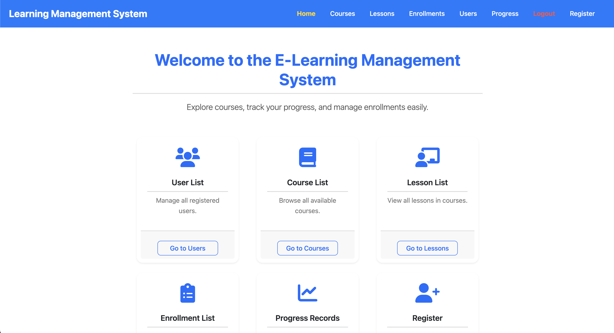
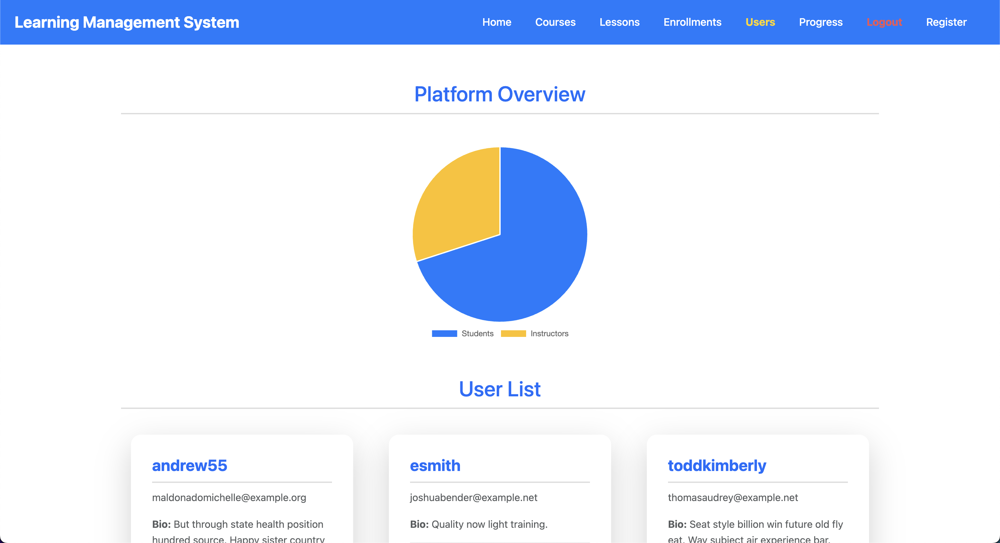
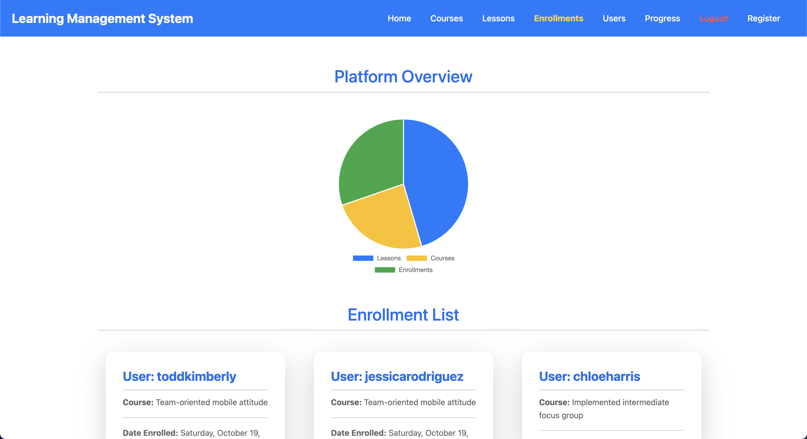
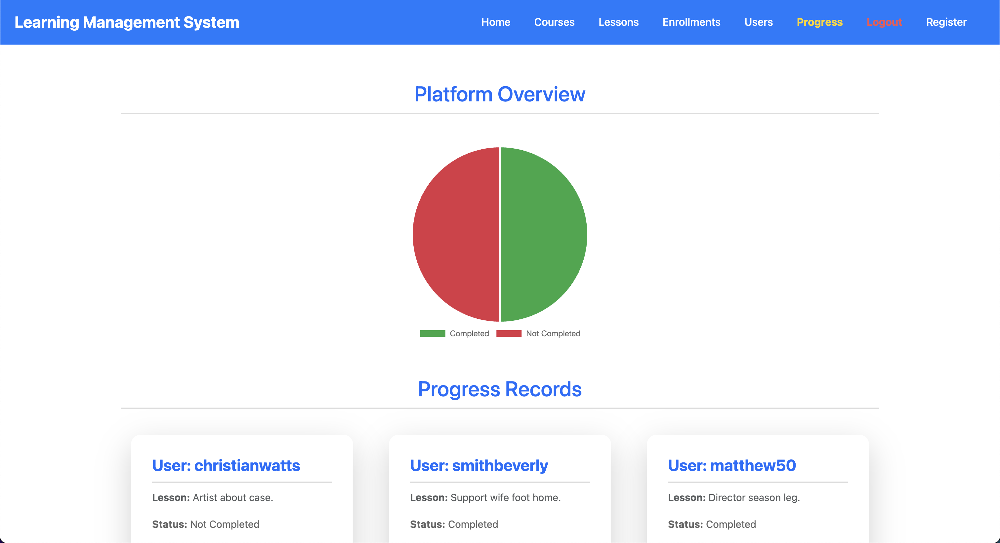
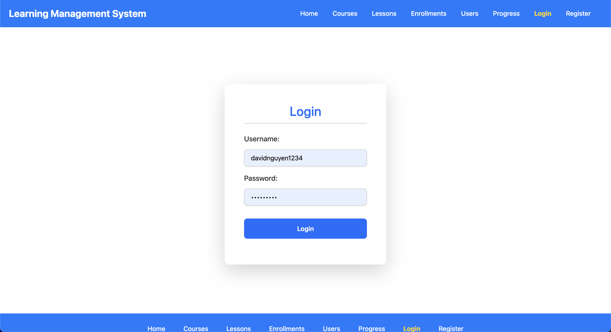

# E-Learning Management Fullstack System

Welcome to the **E-Learning Management System (LMS)**! This project consists of two main components: the **Frontend** (built with Angular) and the **Backend** (developed using Django and Django REST Framework). The LMS is a full-featured web application designed to manage users, courses, lessons, quizzes, and much more. This README provides a complete guide on how to set up, run, and contribute to both parts of the system.

## Table of Contents

- [Project Overview](#project-overview)
  - [The MAD-Stack](#the-mad-stack)
- [Features](#features)
- [File Structure](#file-structure)
- [Detailed Information](#detailed-information)
  - [Available API Endpoints](#available-api-endpoints)
  - [Frontend User Interfaces](#frontend-user-interfaces)
- [Getting Started](#getting-started)
  - [Prerequisites](#prerequisites)
  - [Backend Setup (Django)](#backend-setup)
  - [Frontend Setup (Angular)](#frontend-setup)
- [API Documentation](#api-documentation)
  - [Authentication](#authentication)
  - [Testing the APIs](#testing-the-apis)
  - [Seeding Sample Data](#seeding-sample-data)
  - [Recommended GUI Tools](#recommended-gui-tools)
- [Containerization](#containerization)
- [Troubleshooting](#troubleshooting)
  - [Common Issues](#common-issues)
  - [Debugging Tips](#debugging-tips)
- [Additional Information](#additional-information)
- [Contributing](#contributing)
- [License](#license)
- [Contact](#contact)

## Project Overview

The **E-Learning Management System** is a web-based platform designed to facilitate online education and training. It provides a comprehensive set of features for managing courses, lessons, users, quizzes, and more. The system is composed of:

- **Frontend**: Built with Angular, it offers a user-friendly interface for interacting with the platform.
- **Backend**: Developed using Django and Django REST Framework, it provides robust REST APIs for all the operations.

Because we use **MongoDB**, **Angular**, and **Django**, we call this a **MAD-Stack** application!

### The MAD-Stack

The **MAD-Stack** is a modern web development stack that combines the following technologies:

- **MongoDB**: A NoSQL database used to store data.
- **Angular**: A frontend framework for building web applications.
- **Django**: A high-level Python web framework for backend development.

The **MAD-Stack** is a powerful combination that allows developers to build scalable, responsive, and feature-rich web applications. It leverages the strengths of each technology to create a seamless user experience.

## Features

- **User Authentication**: Token-based authentication for secure login.
- **Course Management**: Create, update, delete, and display courses.
- **Lesson Management**: Manage lessons associated with courses.
- **Quiz Management**: Handle quizzes, questions, and choices.
- **User Management**: Administrate users, enrollments, and user roles.
- **Progress Tracking**: Monitor and visualize user progress.
- **Notification System**: Send and manage notifications.
- **Responsive Design**: Optimized for all devices.
- **Search and Filtering**: Search and filter courses and lessons.
- **Data Visualization**: Dynamic charts using Chart.js.
- **Comprehensive APIs**: Powerful RESTful APIs for all operations.
- **API Documentation**: Comprehensive REST API documentation with Swagger and Redoc.

## File Structure

The project structure is as follows:

```plaintext
Learning-Management-System/
├── LMS-Backend
│   ├── manage.py
│   ├── requirements.txt
│   ├── LICENSE
│   ├── db.sqlite3
│   ├── README.md
│   ├── LMSBackend/
│   │   ├── settings.py
│   │   ├── urls.py
│   │   ├── asgi.py
│   │   └── wsgi.py
│   ├── core/
│   │   ├── management/
│   │   │   └── commands/
│   │   │       └── seed_sample_data.py
│   │   ├── migrations/
│   │   │   └── __init__.py
│   │   ├── models.py
│   │   ├── views.py
│   │   ├── tests.py
│   │   ├── admin.py
│   │   ├── apps.py
│   │   ├── serializers.py
│   │   └── urls.py
├── LMS-Frontend
│   ├── angular.json
│   ├── package.json
│   ├── README.md
│   ├── LICENSE
│   ├── app/
│   │   ├── src/
│   │   │   ├── app/
│   │   │   │   ├── auth/
│   │   │   │   │   ├── login/
│   │   │   │   │   │   ├── login.component.ts
│   │   │   │   │   │   ├── login.component.html
│   │   │   │   │   │   └── login.component.css
│   │   │   │   ├── core/
│   │   │   │   │   ├── footer/
│   │   │   │   │   │   ├── footer.component.ts
│   │   │   │   │   │   ├── footer.component.html
│   │   │   │   │   │   └── footer.component.css
│   │   │   │   │   ├── header/
│   │   │   │   │   │   ├── header.component.ts
│   │   │   │   │   │   ├── header.component.html
│   │   │   │   │   │   └── header.component.css
│   │   │   │   ├── pages/
│   │   │   │   │   ├── home/
│   │   │   │   │   │   ├── home.component.ts
│   │   │   │   │   │   ├── home.component.html
│   │   │   │   │   │   └── home.component.css
│   │   │   │   ├── components/
│   │   │   │   │   ├── course-list/
│   │   │   │   │   │   ├── course-list.component.ts
│   │   │   │   │   │   ├── course-list.component.html
│   │   │   │   │   │   └── course-list.component.css
│   │   │   │   │   ├── lesson-list/
│   │   │   │   │   │   ├── lesson-list.component.ts
│   │   │   │   │   │   ├── lesson-list.component.html
│   │   │   │   │   │   └── lesson-list.component.css
│   │   │   │   │   ├── user-list/
│   │   │   │   │   │   ├── user-list.component.ts
│   │   │   │   │   │   ├── user-list.component.html
│   │   │   │   │   │   └── user-list.component.css
│   │   │   │   │   ├── enrollment-list/
│   │   │   │   │   │   ├── enrollment-list.component.ts
│   │   │   │   │   │   ├── enrollment-list.component.html
│   │   │   │   │   │   └── enrollment-list.component.css
│   │   │   │   │   ├── progress-list/
│   │   │   │   │   │   ├── progress-list.component.ts
│   │   │   │   │   │   ├── progress-list.component.html
│   │   │   │   │   │   └── progress-list.component.css
│   │   │   │   ├── services/
│   │   │   │   │   ├── auth.interceptor.ts
│   │   │   │   │   ├── auth.service.ts
│   │   │   │   │   ├── user.service.ts
│   │   │   │   │   ├── course.service.ts
│   │   │   │   │   ├── lesson.service.ts
│   │   │   │   │   ├── enrollment.service.ts
│   │   │   │   │   └── progress.service.ts
│   │   │   │   ├── app.routes.ts
│   │   │   │   ├── app.component.ts
│   │   │   │   ├── app.config.ts
│   │   │   │   ├── app.config.service.ts
│   │   │   │   ├── app.component.html
│   │   │   │   └── app.component.css
│   │   │   ├── assets/
│   │   │   │   └── images/
│   │   │   │       └── .gitkeep
│   │   │   ├── main.ts
│   │   │   ├── styles.css
│   │   │   └── index.html
│   │   ├── .editorconfig
│   │   ├── .gitignore
│   │   ├── angular.json
│   │   ├── package.json 
│   │   ├── package-lock.json
│   │   ├── tsconfig.json
│   │   ├── tsconfig.app.json
│   │   └── tsconfig.spec.json
│   ├── LICENSE
│   ├── README.md
├── .gitignore
├── LICENSE
└── README.md
```

## Detailed Information:

### Available API Endpoints

| Endpoint                   | Method | Description                                   |
|----------------------------|--------|-----------------------------------------------|
| `/api/users/`              | GET    | Retrieve a list of all users.                 |
| `/api/users/{id}/`         | GET    | Retrieve a specific user instance.            |
| `/api/users/`              | POST   | Create a new user instance.                   |
| `/api/users/{id}/`         | PUT    | Update a specific user instance.              |
| `/api/users/{id}/`         | DELETE | Delete a specific user instance.              |
| `/api/courses/`            | GET    | Retrieve a list of all courses.               |
| `/api/courses/{id}/`       | GET    | Retrieve a specific course instance.          |
| `/api/courses/`            | POST   | Create a new course instance.                 |
| `/api/courses/{id}/`       | PUT    | Update a specific course instance.            |
| `/api/courses/{id}/`       | DELETE | Delete a specific course instance.            |
| `/api/categories/`         | GET    | Retrieve a list of all categories.            |
| `/api/categories/{id}/`    | GET    | Retrieve a specific category instance.        |
| `/api/categories/`         | POST   | Create a new category instance.               |
| `/api/categories/{id}/`    | PUT    | Update a specific category instance.          |
| `/api/categories/{id}/`    | DELETE | Delete a specific category instance.          |
| `/api/lessons/`            | GET    | Retrieve a list of all lessons.               |
| `/api/lessons/{id}/`       | GET    | Retrieve a specific lesson instance.          |
| `/api/lessons/`            | POST   | Create a new lesson instance.                 |
| `/api/lessons/{id}/`       | PUT    | Update a specific lesson instance.            |
| `/api/lessons/{id}/`       | DELETE | Delete a specific lesson instance.            |
| `/api/quizzes/`            | GET    | Retrieve a list of all quizzes.               |
| `/api/quizzes/{id}/`       | GET    | Retrieve a specific quiz instance.            |
| `/api/quizzes/`            | POST   | Create a new quiz instance.                   |
| `/api/quizzes/{id}/`       | PUT    | Update a specific quiz instance.              |
| `/api/quizzes/{id}/`       | DELETE | Delete a specific quiz instance.              |
| `/api/questions/`          | GET    | Retrieve a list of all questions.             |
| `/api/questions/{id}/`     | GET    | Retrieve a specific question instance.        |
| `/api/questions/`          | POST   | Create a new question instance.               |
| `/api/questions/{id}/`     | PUT    | Update a specific question instance.          |
| `/api/questions/{id}/`     | DELETE | Delete a specific question instance.          |
| `/api/choices/`            | GET    | Retrieve a list of all choices.               |
| `/api/choices/{id}/`       | GET    | Retrieve a specific choice instance.          |
| `/api/choices/`            | POST   | Create a new choice instance.                 |
| `/api/choices/{id}/`       | PUT    | Update a specific choice instance.            |
| `/api/choices/{id}/`       | DELETE | Delete a specific choice instance.            |
| `/api/enrollments/`        | GET    | Retrieve a list of all enrollments.           |
| `/api/enrollments/{id}/`   | GET    | Retrieve a specific enrollment instance.      |
| `/api/enrollments/`        | POST   | Create a new enrollment instance.             |
| `/api/enrollments/{id}/`   | PUT    | Update a specific enrollment instance.        |
| `/api/enrollments/{id}/`   | DELETE | Delete a specific enrollment instance.        |
| `/api/progress/`           | GET    | Retrieve a list of all progress records.      |
| `/api/progress/{id}/`      | GET    | Retrieve a specific progress record instance. |
| `/api/progress/`           | POST   | Create a new progress record instance.        |
| `/api/progress/{id}/`      | PUT    | Update a specific progress record instance.   |
| `/api/progress/{id}/`      | DELETE | Delete a specific progress record instance.   |
| `/api/notifications/`      | GET    | Retrieve a list of all notifications.         |
| `/api/notifications/{id}/` | GET    | Retrieve a specific notification instance.    |
| `/api/notifications/`      | POST   | Create a new notification instance.           |
| `/api/notifications/{id}/` | PUT    | Update a specific notification instance.      |
| `/api/notifications/{id}/` | DELETE | Delete a specific notification instance.      |

### Frontend User Interfaces

**Home Page**:

<p align="center" style="cursor: pointer">
  
</p>

**Course List**:

<p align="center" style="cursor: pointer">
  
</p>

**Lesson List**:

<p align="center" style="cursor: pointer">
  
</p>

**User List**:

<p align="center" style="cursor: pointer">
  
</p>

**Enrollment List**:

<p align="center" style="cursor: pointer">
  
</p>

**Progress List**:

<p align="center" style="cursor: pointer">
  
</p>

**Login Page**:

<p align="center" style="cursor: pointer">
  
</p>

**Footer**:

<p align="center" style="cursor: pointer">
  
</p>

## Getting Started

### Prerequisites

Ensure the following prerequisites are installed:

- **Node.js** (v18.19 or later)
- **Angular CLI** (v12 or later)
- **Python** (v3.7 or later)
- **Django** and **Django REST Framework**
- **MongoDB** and **Redis** running locally or remotely

### Backend Setup

1. **Clone the repository:**

   ```bash
   git clone https://github.com/hoangsonww/Learning-Management-System-Fullstack.git
   cd Fullstack-Learning-Management-System/LMS-Backend
   ```

2. **Create and activate a virtual environment:**

   ```bash
   python -m venv .venv
   source .venv/bin/activate  # On Windows, use `.venv\Scripts\activate`
   ```

3. **Install dependencies:**

   ```bash
   pip install -r requirements.txt
   ```

4. **Configure MongoDB and Redis:**

   Ensure MongoDB and Redis are running and configured in `settings.py`. If not installed, follow the instructions to install them. It is very important to run MongoDB and Redis before running the backend server.

5. **Apply migrations:**

   ```bash
   python manage.py makemigrations
   python manage.py migrate
   ```

6. **Create a superuser:**

   ```bash
   python manage.py createsuperuser
   ```
   
    Follow the prompts to create a superuser account. Remember to note down the username and password because you will need it to authenticate when using the APIs later, as well as to access the Django admin panel.

7. **Put the `SECRET_KEY` and set `Debug` to `True` in the `settings.py` file:**

    ```plaintext
    SECRET_KEY = 'your_secret_key_here'
    DEBUG = True
    ```
   
    Replace `your_secret_key_here` with a random string of characters. This key is used for cryptographic signing and should be kept secret. Or you can also contact me to get the secret key.

8. **Seed the database with sample data:**

   ```bash
   python manage.py seed_sample_data
   ```

9. **Run the backend server:**

   ```bash
   python manage.py runserver
   ```
   
    The backend server should now be running at `http://127.0.0.1:8000/`. If the server is run successfully, you should see the Django REST Framework browsable API interface at `http://127.0.0.1:8000`, as well as the following console output:

    ```plaintext
    python manage.py runserver
    Successfully seeded realistic sample data
    Successfully seeded realistic sample data
    Watching for file changes with StatReloader
    Performing system checks...
    
    System check identified no issues (0 silenced).
    September 08, 2024 - 20:35:21
    Django version 4.2.16, using settings 'LMSBackend.settings'
    Starting development server at http://127.0.0.1:8000/
    Quit the server with CONTROL-C.
    ```

### Frontend Setup

1. **Navigate to the frontend directory:**

   ```bash
   cd Learning-Management-System/LMS-Frontend/app
   ```

2. **Install dependencies:**

   ```bash
   npm install
   ```

3. **Start the development server:**

   ```bash
   ng serve
   ```

4. **Open the application in your browser:**

   ```
   http://localhost:4200
   ```

## API Documentation

### Authentication

Most API endpoints require authentication. Use the `/api/auth/login/` endpoint to log in and obtain an authentication token.

1. **Log in to get a token:**

   ```bash
   curl -X POST http://127.0.0.1:8000/api/auth/login/ -H "Content-Type: application/json" -d '{
     "username": "your_username",
     "password": "your_password"
   }'
   ```

   Use the obtained token in the `Authorization` header for subsequent requests:

   ```bash
   -H "Authorization: Token <your_token_here>"
   ```

### Testing the APIs

You can test the API using `curl`, Postman, or Swagger UI.

#### Using `curl`

To test the API using `curl`, use the commands below. Replace `<your_token_here>` with the token obtained from the login endpoint.

- **List All Users**

  ```bash
  curl -X GET http://127.0.0.1:8000/api/users/ -H "Content-Type: application/json" -H "Authorization: Token <your_token_here>"
  ```

  - You should get something like this:

      ```json
      [
        {
          "id":"66dde39af395abfee65d1f86",
          "username":"gibsonstacey",
          "email":"xcaldwell@example.org",
          "is_instructor":false,"is_student":false,
          "bio":"Consider red specific within chance fund successful out.",
          "profile_picture":"https://placekitten.com/970/531"
        }
      ]
      ```

- **Create a New Course**

  ```bash
  curl -X POST http://127.0.0.1:8000/api/courses/ -H "Content-Type: application/json" -H "Authorization: Token <your_token_here>" -d '{
    "title": "New Course",
    "description": "This is a new course description.",
    "instructor": "{user_id}",
    "category": "{category_id}",
    "price": 150.00,
    "published": true
  }'
  ```

Repeat similar `curl` commands for other endpoints.

#### Using Postman

1. Open Postman.
2. Create a new request for each endpoint.
3. Set the method (GET, POST, PUT, DELETE) and URL (e.g., `http://127.0.0.1:8000/api/users/`).
4. Under the "Authorization" tab, choose "Bearer Token" and paste your token.
5. Send the request and check the response.

#### Using Swagger UI

1. Navigate to the Swagger UI at [http://127.0.0.1:8000/swagger/](http://127.0.0.1:8000/swagger/).
2. Click on an endpoint to expand it.
3. Click the "Try it out" button.
4. Enter the required parameters and authentication token (`Token <your_token_here>`) in the "Authorization" header. **Note that the token should be prefixed with `Token` and a space.**
5. Click "Execute" to see the API response.
6. Alternatively, you can simply click the "Authorize" button in the top right corner of the page and enter your token there. This will automatically include the token in all requests. Then repeat steps 3 and 5 to test the endpoints.

Here is how the Swagger UI looks like:

<p align="center" style="cursor: pointer">
  
</p>

#### Using Redoc

1. Navigate to the Redoc UI at [http://127.0.0.1:8000/redoc/](http://127.0.1:8000/redoc/).
2. Click on an endpoint to expand it.
3. View the API documentation and test the endpoints.

Here is how the Redoc UI looks like:

<p align="center" style="cursor: pointer">
  
</p>

#### Using Django REST Framework Browsable API

1. Choose any endpoint from the list above.
2. Navigate to the endpoint URL in your browser.
3. Log in using the superuser credentials.
4. You will see a browsable interface where you can view the details of the endpoint.

For example, to view the list of all lessons, go to [http://127.0.0.1:8000/api/lessons/](http://127.0.0.1:8000/api/lessons/). The interface should look like this:

<p align="center" style="cursor: pointer">
  
</p>

**Well, remember to log in first before accessing the API... Don't forget to log in!**

### Seeding Sample Data

If you want to seed the database with realistic sample data, you can also run the `seed_sample_data` management command:

```bash
python manage.py seed_sample_data
```

This command will populate the database with randomly generated users, courses, categories, lessons, quizzes, questions, choices, enrollments, progress records, and notifications.

**Note:** By default, the `seed_sample_data` command will be executed when you run the `python manage.py migrate` command. If you don't want to seed the database at that time, you can disable it by setting `SEED_SAMPLE_DATA_ON_MIGRATE = False` in the `settings.py` file. Also, your data might be different from mine because the data is randomly generated.
#### Recommended GUI Tools

To interact with the APIs and databases more easily, you can use the following GUI tools:

- **MongoDB Compass**: A GUI tool for MongoDB that allows you to explore and interact with your MongoDB databases. You can download it from [here](https://www.mongodb.com/try/download/compass).
- **RedisInsight**: A GUI tool for Redis that allows you to explore and interact with your Redis databases. You can download it from [here](https://redislabs.com/redis-enterprise/redis-insight/).
- **Postman**: A powerful GUI tool for testing APIs. You can download it from [here](https://www.postman.com/downloads/).
- **Swagger UI**: An interactive API documentation tool. You can access the Swagger UI at [http://127.0.0.1:8000/swagger/](http://127.0.0.1:8000/swagger/). Ensure the server is running before accessing the UI.
- **Redoc**: Another interactive API documentation tool. You can access the Redoc UI at [http://127.0.0.1:8000/redoc/](http://127.0.0.1:8000/redoc/). Ensure the server is running before accessing the UI.

## Containerization

The project can be containerized using Docker. The `Dockerfile` and `docker-compose.yml` files are provided in the repository. To containerize the project, follow these steps:

1. **Change directory into the project root:**

   ```bash
   cd Learning-Management-System
   ```
   
2. **Build the Docker image:**

   ```bash
   docker compose up --build
   ```

## Troubleshooting

### Common Issues

1. **CORS Errors**:
  - Ensure backend CORS settings allow requests from `http://localhost:4200`.

2. **Unauthorized Access**:
  - Confirm that tokens are stored correctly in `localStorage`.

3. **API Connection**:
  - Verify the backend server is running at `http://127.0.0.1:8000`.

4. **Database Connection**:
  - Check MongoDB and Redis are running and accessible.

5. **Dependencies**:
  - Ensure all required dependencies are installed, using `pip install -r requirements.txt` and `npm install`.

6. **UI Issues**:
  - Check the Angular console for errors and warnings. Alternatively, you can try clearing the cache using `npm cache clean --force` and `npm install`.

### Debugging Tips

- Use browser Developer Tools to inspect requests and console logs.
- Check the network tab for failed requests.
- Use `console.log` statements in the frontend code to debug.
- Use `print` statements in the backend code to debug.
- Check the Django console for server-side errors.
- Check the Angular console for client-side errors.
- Refer to the official documentation for troubleshooting tips.
- Feel free to open an issue or contact me for help. Refer to the [Contact](#contact) section below.

## Additional Information

Refer to the README files in the `LMS-Backend` and `LMS-Frontend` directories for more detailed information on each part of the system.

- [Backend README](LMS-Backend/README.md)
- [Frontend README](LMS-Frontend/README.md)

These README files contain additional information on how to run, test, and contribute to the project.

## Contributing

We welcome contributions! Feel free to submit issues and create pull requests.

1. **Fork** the repository.
2. **Clone** the forked repository to your local machine.
3. **Create a new branch** and make your changes.
4. **Commit** your changes and **push** them to your fork.
5. **Create a pull request** to the main repository.
6. I will **review your changes** and **merge them if they are accepted**.

## License

This project is licensed under the [MIT License](LICENSE).

## Contact

If you have any questions or need further assistance, contact us at [hoangson091104@gmail.com](mailto:hoangson091104@gmail.com).

Alternatively, you can also open an issue in the repository [here](https://github.com/hoangsonww/Learning-Management-System-Fullstack/issues).

---

**[⬆ Back to Top](#e-learning-management-fullstack-system)**
