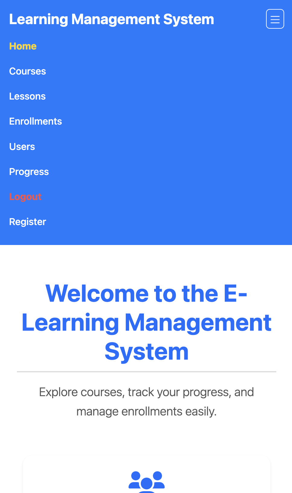

# E-Learning Management Fullstack System

Welcome to the **E-Learning Management System (LMS)**! This project consists of two main components: the **Frontend** (built with **Angular**) and the **Backend** (developed using **Django and Django REST Framework**), combined with CI/CD technologies such as **Docker** and **Jenkins**. The LMS is a full-featured web application designed to manage users, courses, lessons, quizzes, and much more. This README provides a complete guide on how to set up, run, and contribute to both parts of the system.

## Table of Contents

- [Project Overview](#project-overview)
  - [The MAD-Stack](#the-mad-stack)
- [Features](#features)
- [Live Deployment](#live-deployment)
- [Detailed Project Information](#detailed-project-information)
  - [Frontend User Interfaces](#frontend-user-interfaces)
  - [Available API Endpoints](#available-api-endpoints)
  - [Unit Tests for APIs](#unit-tests-for-apis)
- [File Structure](#file-structure)
- [Getting Started](#getting-started)
  - [Prerequisites](#prerequisites)
  - [Backend Setup (Django)](#backend-setup)
  - [Frontend Setup (Angular)](#frontend-setup)
- [API Documentation](#api-documentation)
  - [Authentication](#authentication)
  - [Testing the APIs](#testing-the-apis)
  - [Seeding Sample Data](#seeding-sample-data)
  - [Recommended GUI Tools](#recommended-gui-tools)
  - [MongoDB Atlas](#mongodb-atlas)
- [Containerization](#containerization)
- [Kubernetes](#kubernetes)
- [OpenAPI Specification](#openapi-specification)
- [Jenkins CI/CD](#jenkins-cicd)
- [Troubleshooting](#troubleshooting)
  - [Common Issues](#common-issues)
  - [Debugging Tips](#debugging-tips)
- [Additional Information](#additional-information)
- [Contributing](#contributing)
- [License](#license)
- [Contact](#contact)

## Project Overview

The **E-Learning Management System** is a web-based platform designed to facilitate online education and training. It provides a comprehensive set of features for managing courses, lessons, users, quizzes, and more. The system is composed of:

- **Frontend**: Built with **Angular** and **Bootstrap**, it offers a user-friendly interface for interacting with the platform.
- **Backend**: Developed using **Django** and **Django REST Framework**, it provides robust **REST APIs** for all the operations.
- **Database**: The system uses **MongoDB** to store data and **Redis** for efficient server-side caching, as well as **SQLite** for user authentication with Django Auth.
- **CI/CD**: The project includes a `Dockerfile` and `docker-compose.yml` for containerization and deployment, as well as a `Jenkinsfile` for CI/CD pipelines and `Kubernetes` configuration files for orchestration.

Because we use **MongoDB**, **Angular**, and **Django**, we call this a **MAD-Stack** application! _(Just a fun name to remember the technologies used)_

### The MAD-Stack

The **MAD-Stack** is a modern web development stack that combines the following technologies:

- **MongoDB**: A NoSQL database used to store course, lessons, enrollments, users, and other data.
- **Angular**: A frontend framework for building web applications.
- **Django**: A high-level Python web framework for backend development.

The **MAD-Stack** is a powerful combination that allows developers to build scalable, responsive, and feature-rich web applications. It leverages the strengths of each technology to create a seamless user experience.

## Features

- **User Authentication**: Token-based authentication for secure login, built with Django Auth.
- **Server-Side Caching**: Redis caching for improved performance and reduced server load.
- **Course Management**: Create, update, delete, and display courses.
- **Lesson Management**: Manage lessons associated with courses.
- **Quiz Management**: Handle quizzes, questions, and choices.
- **User Management**: Administrate users, enrollments, and user roles.
- **Progress Tracking**: Monitor and visualize user progress.
- **Notification System**: Send and manage notifications.
- **Responsive Design**: Optimized for all devices.
- **Search and Filtering**: Search and filter courses and lessons.
- **Data Visualization**: Dynamic charts using Chart.js.
- **Comprehensive APIs**: Powerful RESTful APIs for all operations.
- **API Documentation**: Comprehensive REST API documentation with Swagger and Redoc.

## Live Deployment

The project is currently deployed live on Vercel and Render. You can access the live deployment using the following link: [E-Learning Management System](https://learning-manangement-system.vercel.app).

The backend is deployed on Render: [Backend API](https://learning-management-system-fullstack.onrender.com/).

Feel free to explore the platform, create an account, and test out the features.

> **Note:** Our backend server may spin down due to inactivity, so you may experience delays in loading data initially as the backend is hosted on the free tier of Render. If you encounter any issues, please let me know.

## Detailed Project Information:

### Frontend User Interfaces

**Home Page**:

<p align="center" style="cursor: pointer">
  
</p>

**Course List**:

<p align="center" style="cursor: pointer">
  
</p>

**Lesson List**:

<p align="center" style="cursor: pointer">
  
</p>

**User List**:

<p align="center" style="cursor: pointer">
  
</p>

**Enrollment List**:

<p align="center" style="cursor: pointer">
  
</p>

**Progress List**:

<p align="center" style="cursor: pointer">
  
</p>

**Registration Page**:

<p align="center" style="cursor: pointer">
  
</p>

**Login Page**:

<p align="center" style="cursor: pointer">
  
</p>

**Unauthorized Access (when not logged in)**:

<p align="center" style="cursor: pointer">
  
</p>

**Not Found Page**:

<p align="center" style="cursor: pointer">
  
</p>

**Footer**:

<p align="center" style="cursor: pointer">
  
</p>

**Responsive Design**: The frontend is fully responsive and optimized for all devices. Here is an example of the mobile view:

<p align="center" style="cursor: pointer">
  
</p>

**And many more pages & features. Feel free to explore the frontend and backend to see all the functionalities!**

### Available API Endpoints

| Endpoint                   | Method | Description                                   |
|----------------------------|--------|-----------------------------------------------|
| `/api/users/`              | GET    | Retrieve a list of all users.                 |
| `/api/users/{id}/`         | GET    | Retrieve a specific user instance.            |
| `/api/users/`              | POST   | Create a new user instance.                   |
| `/api/users/{id}/`         | PUT    | Update a specific user instance.              |
| `/api/users/{id}/`         | DELETE | Delete a specific user instance.              |
| `/api/courses/`            | GET    | Retrieve a list of all courses.               |
| `/api/courses/{id}/`       | GET    | Retrieve a specific course instance.          |
| `/api/courses/`            | POST   | Create a new course instance.                 |
| `/api/courses/{id}/`       | PUT    | Update a specific course instance.            |
| `/api/courses/{id}/`       | DELETE | Delete a specific course instance.            |
| `/api/categories/`         | GET    | Retrieve a list of all categories.            |
| `/api/categories/{id}/`    | GET    | Retrieve a specific category instance.        |
| `/api/categories/`         | POST   | Create a new category instance.               |
| `/api/categories/{id}/`    | PUT    | Update a specific category instance.          |
| `/api/categories/{id}/`    | DELETE | Delete a specific category instance.          |
| `/api/lessons/`            | GET    | Retrieve a list of all lessons.               |
| `/api/lessons/{id}/`       | GET    | Retrieve a specific lesson instance.          |
| `/api/lessons/`            | POST   | Create a new lesson instance.                 |
| `/api/lessons/{id}/`       | PUT    | Update a specific lesson instance.            |
| `/api/lessons/{id}/`       | DELETE | Delete a specific lesson instance.            |
| `/api/quizzes/`            | GET    | Retrieve a list of all quizzes.               |
| `/api/quizzes/{id}/`       | GET    | Retrieve a specific quiz instance.            |
| `/api/quizzes/`            | POST   | Create a new quiz instance.                   |
| `/api/quizzes/{id}/`       | PUT    | Update a specific quiz instance.              |
| `/api/quizzes/{id}/`       | DELETE | Delete a specific quiz instance.              |
| `/api/questions/`          | GET    | Retrieve a list of all questions.             |
| `/api/questions/{id}/`     | GET    | Retrieve a specific question instance.        |
| `/api/questions/`          | POST   | Create a new question instance.               |
| `/api/questions/{id}/`     | PUT    | Update a specific question instance.          |
| `/api/questions/{id}/`     | DELETE | Delete a specific question instance.          |
| `/api/choices/`            | GET    | Retrieve a list of all choices.               |
| `/api/choices/{id}/`       | GET    | Retrieve a specific choice instance.          |
| `/api/choices/`            | POST   | Create a new choice instance.                 |
| `/api/choices/{id}/`       | PUT    | Update a specific choice instance.            |
| `/api/choices/{id}/`       | DELETE | Delete a specific choice instance.            |
| `/api/enrollments/`        | GET    | Retrieve a list of all enrollments.           |
| `/api/enrollments/{id}/`   | GET    | Retrieve a specific enrollment instance.      |
| `/api/enrollments/`        | POST   | Create a new enrollment instance.             |
| `/api/enrollments/{id}/`   | PUT    | Update a specific enrollment instance.        |
| `/api/enrollments/{id}/`   | DELETE | Delete a specific enrollment instance.        |
| `/api/progress/`           | GET    | Retrieve a list of all progress records.      |
| `/api/progress/{id}/`      | GET    | Retrieve a specific progress record instance. |
| `/api/progress/`           | POST   | Create a new progress record instance.        |
| `/api/progress/{id}/`      | PUT    | Update a specific progress record instance.   |
| `/api/progress/{id}/`      | DELETE | Delete a specific progress record instance.   |
| `/api/notifications/`      | GET    | Retrieve a list of all notifications.         |
| `/api/notifications/{id}/` | GET    | Retrieve a specific notification instance.    |
| `/api/notifications/`      | POST   | Create a new notification instance.           |
| `/api/notifications/{id}/` | PUT    | Update a specific notification instance.      |
| `/api/notifications/{id}/` | DELETE | Delete a specific notification instance.      |

### Unit Tests for APIs

The backend includes unit tests for the APIs. You can run the tests using the following command:

```bash
python manage.py test
```

Feel free to view and modify the tests in the `core/tests.py` file. Also, be sure to adjust the URLs in the test cases to match your actual URL configuration if different from the default.

## File Structure

The project structure is as follows:

```plaintext
Learning-Management-System/
├── LMS-Backend
│   ├── .gitignore
│   ├── Dockerfile
│   ├── manage.py
│   ├── requirements.txt
│   ├── LICENSE
│   ├── db.sqlite3
│   ├── README.md
│   ├── LMSBackend/
│   │   ├── settings.py
│   │   ├── urls.py
│   │   ├── asgi.py
│   │   └── wsgi.py
│   └── core/
│       ├── management/
│       │   └── commands/
│       │       └── seed_sample_data.py
│       ├── migrations/
│       │   └── __init__.py
│       ├── models.py
│       ├── views.py
│       ├── tests.py
│       ├── admin.py
│       ├── apps.py
│       ├── serializers.py
│       └── urls.py
│   
├── LMS-Frontend
│   ├── angular.json
│   ├── package.json
│   ├── Dockerfile
│   ├── README.md
│   ├── LICENSE
│   ├── app/
│   │   ├── src/
│   │   │   ├── app/
│   │   │   │   ├── auth/
│   │   │   │   │   ├── login/
│   │   │   │   │   │   ├── login.component.ts
│   │   │   │   │   │   ├── login.component.html
│   │   │   │   │   │   └── login.component.css
│   │   │   │   │   ├── register/
│   │   │   │   │   │   ├── register.component.ts
│   │   │   │   │   │   ├── register.component.html
│   │   │   │   │   │   └── register.component.css
│   │   │   │   ├── core/
│   │   │   │   │   ├── footer/
│   │   │   │   │   │   ├── footer.component.ts
│   │   │   │   │   │   ├── footer.component.html
│   │   │   │   │   │   └── footer.component.css
│   │   │   │   │   ├── header/
│   │   │   │   │   │   ├── header.component.ts
│   │   │   │   │   │   ├── header.component.html
│   │   │   │   │   │   └── header.component.css
│   │   │   │   ├── pages/
│   │   │   │   │   ├── home/
│   │   │   │   │   │   ├── notfound.component.ts
│   │   │   │   │   │   ├── notfound.component.html
│   │   │   │   │   │   └── home.component.css
│   │   │   │   │   ├── notfound/
│   │   │   │   │   │   ├── notfound.component.ts
│   │   │   │   │   │   ├── notfound.component.html
│   │   │   │   │   │   └── notfound.component.css
│   │   │   │   ├── components/
│   │   │   │   │   ├── course-list/
│   │   │   │   │   │   ├── course-list.component.ts
│   │   │   │   │   │   ├── course-list.component.html
│   │   │   │   │   │   └── course-list.component.css
│   │   │   │   │   ├── lesson-list/
│   │   │   │   │   │   ├── lesson-list.component.ts
│   │   │   │   │   │   ├── lesson-list.component.html
│   │   │   │   │   │   └── lesson-list.component.css
│   │   │   │   │   ├── user-list/
│   │   │   │   │   │   ├── user-list.component.ts
│   │   │   │   │   │   ├── user-list.component.html
│   │   │   │   │   │   └── user-list.component.css
│   │   │   │   │   ├── enrollment-list/
│   │   │   │   │   │   ├── enrollment-list.component.ts
│   │   │   │   │   │   ├── enrollment-list.component.html
│   │   │   │   │   │   └── enrollment-list.component.css
│   │   │   │   │   ├── progress-list/
│   │   │   │   │   │   ├── progress-list.component.ts
│   │   │   │   │   │   ├── progress-list.component.html
│   │   │   │   │   │   └── progress-list.component.css
│   │   │   │   ├── services/
│   │   │   │   │   ├── auth.interceptor.ts
│   │   │   │   │   ├── auth.service.ts
│   │   │   │   │   ├── user.service.ts
│   │   │   │   │   ├── course.service.ts
│   │   │   │   │   ├── lesson.service.ts
│   │   │   │   │   ├── enrollment.service.ts
│   │   │   │   │   └── progress.service.ts
│   │   │   │   ├── app.routes.ts
│   │   │   │   ├── app.component.ts
│   │   │   │   ├── app.config.ts
│   │   │   │   ├── app.config.service.ts
│   │   │   │   ├── app.component.html
│   │   │   │   └── app.component.css
│   │   │   ├── assets/
│   │   │   │   ├── <images...>
│   │   │   │   └── .gitkeep
│   │   │   ├── main.ts
│   │   │   ├── styles.css
│   │   │   ├── manifest.json
│   │   │   └── index.html
│   │   ├── .editorconfig
│   │   ├── .gitignore
│   │   ├── angular.json
│   │   ├── package.json 
│   │   ├── package-lock.json
│   │   ├── tsconfig.json
│   │   ├── tsconfig.app.json
│   │   └── tsconfig.spec.json
│   ├── LICENSE
│   └── README.md
│
├── nginx
│   ├── nginx.conf
│   └── Dockerfile
│
├── kubernetes
│   ├── configmap.yaml
│   ├── backend-deployment.yaml
│   ├── backend-service.yaml
│   ├── frontend-deployment.yaml
│   └── frontend-service.yaml
│
├── .gitignore
├── .env.example
├── docker-compose.yml
├── Jenkinsfile
├── openapi.yaml
├── LICENSE
└── README.md
```

## Getting Started

### Prerequisites

Ensure the following prerequisites are installed:

- **Node.js** (v18.19 or later)
- **Angular CLI** (v12 or later)
- **Python** (v3.7 or later)
- **Django** and **Django REST Framework**
- **MongoDB** and **Redis** running locally or remotely

### Backend Setup

**Note:** Before running the backend server, ensure MongoDB and Redis are running and accessible on your system. You can install MongoDB and Redis locally or use cloud services like MongoDB Atlas and Redis Cloud.

1. **Clone the repository:**

   ```bash
   git clone https://github.com/hoangsonww/Learning-Management-System-Fullstack.git
   cd Fullstack-Learning-Management-System/LMS-Backend
   ```

2. **Create and activate a virtual environment:**

   ```bash
   python -m venv .venv
   source .venv/bin/activate  # On Windows, use `.venv\Scripts\activate`
   ```

3. **Install dependencies:**

   ```bash
   pip install -r requirements.txt
   ```

4. **Configure MongoDB and Redis:**

   Ensure MongoDB and Redis are running and configured in `settings.py`. If not installed, follow the instructions to install them. It is very important to run MongoDB and Redis before running the backend server.

   Additionally, edit the `.env` file according to the `.env.example` file with the correct MongoDB and Redis connection strings.

5. **Apply migrations:**

   ```bash
   python manage.py makemigrations
   python manage.py migrate
   ```

6. **Create a superuser:**

   ```bash
   python manage.py createsuperuser
   ```
   
    Follow the prompts to create a superuser account. Remember to note down the username and password because you will need it to authenticate when using the APIs later, as well as to access the Django admin panel.

7. **Put the `SECRET_KEY` and set `Debug` to `True` in the `settings.py` file:**

    ```plaintext
    SECRET_KEY = 'your_secret_key_here'
    DEBUG = True
    ```
   
    Replace `your_secret_key_here` with a random string of characters. This key is used for cryptographic signing and should be kept secret. Or you can also contact me to get the secret key.

    Alternatively, create an `.env` file in the project root directory following the format in the `.env.example` file:

    ```plaintext
    DJANGO_SECRET_KEY=your_secret_key_here
    DJANGO_DEBUG=True
    (...)
    ```

8. **Seed the database with sample data:**

   ```bash
   python manage.py seed_sample_data
   ```

9. **Run the backend server:**

   ```bash
   python manage.py runserver
   ```
   
    The backend server should now be running at `http://127.0.0.1:8000/`. If the server is run successfully, you should see the Django REST Framework browsable API interface at `http://127.0.0.1:8000`, as well as the following console output:

    ```plaintext
    python manage.py runserver
    Successfully seeded realistic sample data
    Successfully seeded realistic sample data
    Watching for file changes with StatReloader
    Performing system checks...
    
    System check identified no issues (0 silenced).
    September 08, 2024 - 20:35:21
    Django version 4.2.16, using settings 'LMSBackend.settings'
    Starting development server at http://127.0.0.1:8000/
    Quit the server with CONTROL-C.
    ```

### Frontend Setup

1. **Navigate to the frontend directory:**

   ```bash
   cd Learning-Management-System/LMS-Frontend/app
   ```

2. **Install dependencies:**

   ```bash
   npm install
   ```

3. **Start the development server:**

   ```bash
   ng serve
   ```

4. **Open the application in your browser:**

   ```
   http://localhost:4200
   ```
   
5. **Test out the PWA functionality:**

   - Open the application in your browser.
   - Click on the "Install" button in the address bar to install the PWA.
   - Check the installed PWA in your system applications.
   - Open the installed PWA and test its functionality.

## API Documentation

### Authentication

Most API endpoints require authentication. Use the `/api/auth/login/` endpoint to log in and obtain an authentication token.

1. **Log in to get a token:**

   ```bash
   curl -X POST http://127.0.0.1:8000/api/auth/login/ -H "Content-Type: application/json" -d '{
     "username": "your_username",
     "password": "your_password"
   }'
   ```

   Use the obtained token in the `Authorization` header for subsequent requests:

   ```bash
   -H "Authorization: Token <your_token_here>"
   ```

### Testing the APIs

You can test the API using `curl`, Postman, or Swagger UI.

#### Using `curl`

To test the API using `curl`, use the commands below. Replace `<your_token_here>` with the token obtained from the login endpoint.

- **List All Users**

  ```bash
  curl -X GET http://127.0.0.1:8000/api/users/ -H "Content-Type: application/json" -H "Authorization: Token <your_token_here>"
  ```

  - You should get something like this:

      ```json
      [
        {
          "id":"66dde39af395abfee65d1f86",
          "username":"gibsonstacey",
          "email":"xcaldwell@example.org",
          "is_instructor":false,"is_student":false,
          "bio":"Consider red specific within chance fund successful out.",
          "profile_picture":"https://placekitten.com/970/531"
        }
      ]
      ```

- **Create a New Course**

  ```bash
  curl -X POST http://127.0.0.1:8000/api/courses/ -H "Content-Type: application/json" -H "Authorization: Token <your_token_here>" -d '{
    "title": "New Course",
    "description": "This is a new course description.",
    "instructor": "{user_id}",
    "category": "{category_id}",
    "price": 150.00,
    "published": true
  }'
  ```

Repeat similar `curl` commands for other endpoints.

#### Using Postman

1. Open Postman.
2. Create a new request for each endpoint.
3. Set the method (GET, POST, PUT, DELETE) and URL (e.g., `http://127.0.0.1:8000/api/users/`).
4. Under the "Authorization" tab, choose "Bearer Token" and paste your token.
5. Send the request and check the response.

#### Using Swagger UI

1. Navigate to the Swagger UI at [http://127.0.0.1:8000/swagger/](http://127.0.0.1:8000/swagger/).
2. Click on an endpoint to expand it.
3. Click the "Try it out" button.
4. Enter the required parameters and authentication token (`Token <your_token_here>`) in the "Authorization" header. **Note that the token should be prefixed with `Token` and a space.**
5. Click "Execute" to see the API response.
6. Alternatively, you can simply click the "Authorize" button in the top right corner of the page and enter your token there. This will automatically include the token in all requests. Then repeat steps 3 and 5 to test the endpoints.

Here is how the Swagger UI looks like:

<p align="center" style="cursor: pointer">
  
</p>

#### Using Redoc

1. Navigate to the Redoc UI at [http://127.0.0.1:8000/redoc/](http://127.0.1:8000/redoc/).
2. Click on an endpoint to expand it.
3. View the API documentation and test the endpoints.

Here is how the Redoc UI looks like:

<p align="center" style="cursor: pointer">
  
</p>

#### Using Django REST Framework Browsable API

1. Choose any endpoint from the list above.
2. Navigate to the endpoint URL in your browser.
3. Log in using the superuser credentials.
4. You will see a browsable interface where you can view the details of the endpoint.

For example, to view the list of all lessons, go to [http://127.0.0.1:8000/api/lessons/](http://127.0.0.1:8000/api/lessons/). The interface should look like this:

<p align="center" style="cursor: pointer">
  
</p>

**Well, remember to log in first before accessing the API... Don't forget to log in!**

### Seeding Sample Data

If you want to seed the database with realistic sample data, you can also run the `seed_sample_data` management command:

```bash
python manage.py seed_sample_data
```

This command will populate the database with randomly generated users, courses, categories, lessons, quizzes, questions, choices, enrollments, progress records, and notifications.

**Note:** By default, the `seed_sample_data` command will be executed when you run the `python manage.py migrate` command. If you don't want to seed the database at that time, you can disable it by setting `SEED_SAMPLE_DATA_ON_MIGRATE = False` in the `settings.py` file. Also, your data might be different from mine because the data is randomly generated.

#### Recommended GUI Tools

To interact with the APIs and databases more easily, you can use the following GUI tools:

- **MongoDB Compass**: A GUI tool for MongoDB that allows you to explore and interact with your MongoDB databases. You can download it from [here](https://www.mongodb.com/try/download/compass).
- **RedisInsight**: A GUI tool for Redis that allows you to explore and interact with your Redis databases. You can download it from [here](https://redislabs.com/redis-enterprise/redis-insight/).
- **Postman**: A powerful GUI tool for testing APIs. You can download it from [here](https://www.postman.com/downloads/).
- **Insomnia**: Another great GUI tool for testing APIs. You can download it from [here](https://insomnia.rest/download).
- **Swagger UI**: An interactive API documentation tool. You can access the Swagger UI at [http://127.0.0.1:8000/swagger/](http://127.0.0.1:8000/swagger/). Ensure the server is running before accessing the UI.
- **Redoc**: Another interactive API documentation tool. You can access the Redoc UI at [http://127.0.0.1:8000/redoc/](http://127.0.0.1:8000/redoc/). Ensure the server is running before accessing the UI.

For example, you can use MongoDB Compass to view the data in your MongoDB database, RedisInsight to view the data in your Redis database, and Postman to test the API endpoints, like below:

<p align="center" style="cursor: pointer">
  
</p>

#### MongoDB Atlas

This project is set up to use MongoDB Atlas as the cloud database. You can create a free account on MongoDB Atlas and set up a free cluster to use with the project. Follow these steps to set up MongoDB Atlas:

1. **Create a MongoDB Atlas account:**

   - Go to the [MongoDB Atlas website](https://www.mongodb.com/cloud/atlas).
   - Click on "Get started free".
   - Create an account and log in.

2. **Create a free cluster:**

    - Click on "Build a Cluster".
    - Choose the free tier option.
    - Select the cloud provider and region.
    - Click "Create Cluster".

3. **Connect to your cluster:**

    - Click on "Connect" to connect to your cluster.
    - Whitelist your IP address.
    - Create a MongoDB user and password.

4. **Get your connection string:**

    - Click on "Connect" and choose "Connect your application".
    - Copy the connection string.

5. **Set up the connection string in the Django settings:**
  
      - Replace the `.env` configuration file with the connection string from MongoDB Atlas.

Alternatively, you can use the local MongoDB server for development and testing purposes.

## Containerization

The project can be containerized using Docker. The `Dockerfile` and `docker-compose.yml` files are provided in the repository. To containerize the project, follow these steps:

1. **Change directory into the project root:**

   ```bash
   cd Learning-Management-System
   ```
   
2. **Build the Docker image:**

   ```bash
   docker compose up --build
   ```
   
The above command will build the Docker image and start the containers for the backend, frontend, MongoDB, and Redis. You can access the application at `http://localhost:4200` and the Django REST Framework API at `http://localhost:8000`.

## Kubernetes

The project includes Kubernetes configuration files for deploying the backend and frontend applications. The `Kubernetes` directory contains the following files:

- **configmap.yaml**: Contains the configuration settings for the backend application.
- **backend-deployment.yaml**: Defines the deployment for the backend application.
- **backend-service.yaml**: Defines the service for the backend application.
- **frontend-deployment.yaml**: Defines the deployment for the frontend application.
- **frontend-service.yaml**: Defines the service for the frontend application.

To deploy the applications to a Kubernetes cluster, follow these steps:

1. **Change directory into the `Kubernetes` directory:**

   ```bash
   cd Kubernetes
   ```
   
2. **Create the configmap:**

   ```bash
    kubectl apply -f configmap.yaml
    ```
   
3. **Create the backend deployment:**

   ```bash
   kubectl apply -f backend-deployment.yaml
   ```
   
4. **Create the backend service:**

   ```bash
    kubectl apply -f backend-service.yaml
    ```
   
5. **Create the frontend deployment:**

   ```bash
    kubectl apply -f frontend-deployment.yaml
    ```
   
6. **Create the frontend service:**

   ```bash
    kubectl apply -f frontend-service.yaml
    ```
   
The above commands will create the deployments and services for the backend and frontend applications. You can access the applications using the NodePort or LoadBalancer service IP addresses.

## OpenAPI Specification

### Using the `openapi.yaml` File

1. **View the API Documentation**
- Open [Swagger Editor](https://editor.swagger.io/).
- Upload the `openapi.yaml` file or paste its content.
- Visualize and interact with the API documentation.

2. **Test the API**
- Import `openapi.yaml` into [Postman](https://www.postman.com/):
  - Open Postman → Import → Select `openapi.yaml`.
  - Test the API endpoints directly from Postman.
- Or use [Swagger UI](https://swagger.io/tools/swagger-ui/):
  - Provide the file URL or upload it to view and test endpoints.

3. **Generate Client Libraries**
- Install OpenAPI Generator:
  ```bash
  npm install @openapitools/openapi-generator-cli -g
  ```
- Generate a client library:
  ```bash
  openapi-generator-cli generate -i openapi.yaml -g <language> -o ./client
  ```
- Replace `<language>` with the desired programming language.

4. **Generate Server Stubs**
- Generate a server stub:
  ```bash
  openapi-generator-cli generate -i openapi.yaml -g <framework> -o ./server
  ```
- Replace `<framework>` with the desired framework.

5. **Run a Mock Server**
- Install Prism:
  ```bash
  npm install -g @stoplight/prism-cli
  ```
- Start the mock server:
  ```bash
  prism mock openapi.yaml
  ```

6. **Validate the OpenAPI File**
- Use [Swagger Validator](https://validator.swagger.io/):
  - Upload `openapi.yaml` or paste its content to check for errors.

This guide enables you to view, test, and utilize the API. You can also generate client libraries, server stubs, and run a mock server using the OpenAPI specification.

## Jenkins CI/CD

The project includes a `Jenkinsfile` for setting up CI/CD pipelines using Jenkins. The Jenkinsfile defines the stages for building, testing, and deploying the backend and frontend applications.

To set up the CI/CD pipelines using Jenkins, follow these steps:

1. **Install Jenkins on your system or use a cloud-based Jenkins service.**

2. **Create a new Jenkins pipeline project.**

3. **Configure the pipeline to use the Jenkinsfile in the project repository.**

4. **Run the pipeline to build, test, and deploy the applications.**

The Jenkins pipeline will automatically build the Docker images, run the unit tests, and deploy the applications to a Kubernetes cluster.

## Troubleshooting

### Common Issues

1. **CORS Errors**:
  - Ensure backend CORS settings allow requests from `http://localhost:4200`.

2. **Unauthorized Access**:
  - Confirm that tokens are stored correctly in `localStorage`.

3. **API Connection**:
  - Verify the backend server is running at `http://127.0.0.1:8000`.

4. **Database Connection**:
  - Check MongoDB and Redis are running and accessible.

5. **Dependencies**:
  - Ensure all required dependencies are installed, using `pip install -r requirements.txt` and `npm install`.

6. **UI Issues**:
  - Check the Angular console for errors and warnings. Alternatively, you can try clearing the cache using `npm cache clean --force` and `npm install`.

7. **Unable to Log In**:
  - Because we are using default Django Auth and SQLite to optimize infrastructure costs, perhaps the user you are trying to log in with does not exist. Sometimes SQLite does not save the data after the server is restarted. 
  - Therefore, please try registering a new user and logging in with that user to bypass this issue.
  - You can also try to create a new user using the Django admin panel or the `createsuperuser` command.
  - Sorry for any inconvenience this may cause! I am planning to switch to Firebase Auth in the future to avoid this issue, but I will need to get some funding first since I have run out of free tier resources...

### Debugging Tips

- Use browser Developer Tools to inspect requests and console logs.
- Check the network tab for failed requests.
- Use `console.log` statements in the frontend code to debug.
- Use `print` statements in the backend code to debug.
- Check the Django console for server-side errors.
- Check the Angular console for client-side errors.
- Refer to the official documentation for troubleshooting tips.
- Feel free to open an issue or contact me for help. Refer to the [Contact](#contact) section below.

## Additional Information

Refer to the README files in the `LMS-Backend` and `LMS-Frontend` directories for more detailed information on each part of the system.

- [Backend README](LMS-Backend/README.md)
- [Frontend README](LMS-Frontend/README.md)

These README files contain additional information on how to run, test, and contribute to the project.

## Contributing

We welcome contributions! Feel free to submit issues and create pull requests.

1. **Fork** the repository.
2. **Clone** the forked repository to your local machine.
3. **Create a new branch** and make your changes.
4. **Commit** your changes and **push** them to your fork.
5. **Create a pull request** to the main repository.
6. I will **review your changes** and **merge them if they are accepted**.

## License

This project is licensed under the [MIT License](LICENSE).

## Contact

If you have any questions or need further assistance, contact us at [hoangson091104@gmail.com](mailto:hoangson091104@gmail.com).

Alternatively, you can also open an issue in the repository [here](https://github.com/hoangsonww/Learning-Management-System-Fullstack/issues).

---

**[⬆ Back to Top](#e-learning-management-fullstack-system)**
